# Agentics — Design
**Author: Ebrahim Alhaddad**
> A multi-agent orchestration system, demonstrated on exploratory data analysis.
> The analysis is the **load**. The orchestration is the **product**.

---

## 1. What this is, and why

### 1.1 The problem

When an organization decides to automate a function with agents — a reporting
team, a reconciliation desk, a support triage queue — the demo is easy and the
system is hard. The demo is a model with a tool. The system is everything
underneath it:

1. **Decomposition.** Turning one request into units of work small enough to
   check, and expressing what each unit needs from the others.
2. **Scoping.** Deciding what each unit is allowed to see, and enforcing that
   rather than asking a prompt nicely.
3. **Distribution.** Running independent units at the same time, on different
   machines, without them corrupting each other's state.
4. **Verification.** Proving a result before anything downstream trusts it, when
   the thing that produced it can be confidently wrong.
5. **Recovery.** Surviving a worker that dies mid-task, a queue that delivers
   twice, and a deploy that restarts every process at once.
6. **Control.** Putting a human in front of the execution path after planning,
   but before task workers incur the larger variable cost.

None of those six are model problems. They are distributed-systems problems that
happen to have a model inside them, and they are the same six whether the agents
write pandas, file tickets, or reconcile invoices.

This project implements the core machinery for those six and makes the remaining
recovery and production-hardening gaps explicit. Choosing a domain is choosing a
**test load** to exercise them, and the choice was deliberate.

Two core extensions remain in development. **Automatic graph improvement** will
allow a run to re-plan after execution reveals failed, insufficient, or poorly
decomposed work. **Metering** will attribute model and execution cost to each task
and run while work is in progress, making cost visible before it becomes only an
after-the-fact bill.

### 1.2 Why build it from scratch

The system deliberately does not use a managed agent platform, a hosted workflow
engine, or MCP servers for the parts it is trying to demonstrate. That is not
ideology, and it is not a claim that those tools are bad — it is that **you learn
where a system breaks by building the part that breaks.**

Using an off-the-shelf orchestrator would have skipped precisely the problems
worth understanding. The bugs this project actually produced — a run stranded
because a dedup id was unique in the present but not across history, tasks
orphaned when a worker died between writing status and publishing its
notification, an analyst confidently summing a column it was never granted —
are invisible when a vendor owns that layer. They are also exactly the failures
that a team running this in production would have to diagnose themselves.

Managed platforms are often the right choice, but their boundary becomes visible
when:

- data cannot leave the organization's environment;
- the workflow depends on bespoke internal systems;
- execution, state transitions, and recovery semantics must be controlled directly;
- the operating model requires infrastructure-level observability and isolation.

Those are the workloads for which the orchestration layer stops being a product
configuration problem and becomes part of the application itself.

### 1.3 Why analytics is the right test load

Two claims, both supportable.

**First: it is under-represented relative to how hard it is.** Agent evaluation
has concentrated on software engineering. SWE-bench alone spans 2,294
issue-commit pairs across 12 Python repositories and has become the default
yardstick. The data-analysis equivalents are far younger and far smaller —
DSBench collects 540 tasks from ModelOff and Kaggle
([OpenReview](https://openreview.net/forum?id=DSsSPr0RZJ)), and DABstep offers
~450 multi-step tasks derived from a financial analytics platform
([arXiv](https://arxiv.org/html/2506.23719v1)). The literature on those
benchmarks is explicit that prior evaluation leaned on synthetic tasks,
oversimplified scoring, or subjective judgment. That gap is the opportunity: the
problem is not solved, and the evaluation apparatus is still being built.

**Second: the failure mode is honest rather than flattering.**

| Property | Why it matters here |
|---|---|
| **Code either runs or it doesn't** | The validation layer gets real ground truth to stand on, instead of an LLM grading an LLM |
| **But running ≠ correct** | A `groupby` on the wrong column runs perfectly and answers the wrong question. Deterministic gates are therefore *provably* insufficient — which forces a layered validation stack rather than a hand-wave |
| **Naturally parallel** | One question across many segments, files, or cohorts is fan-out that is not decorative |
| **Naturally long-running** | Minutes today; hours once a task pulls a real dataset, fits a model, or fans out across hundreds of segments |


### 1.4 What this deliberately is not

Agentics is not intended to replace an interactive notebook or a chat-based data
analysis tool for a single, short question. It is intentionally more structured:
questions become task graphs, intermediate outputs are persisted, and execution
is separated from the request that initiated it.

It is also not a general-purpose agent framework. The boundary is explicit:

> **The model proposes the plan; specialized agents collaborate over deterministic scheduling machinery**

The planner uses model judgment because decomposition and task wording are not
fully mechanical. The orchestrator does not use a model because dependency
resolution, task eligibility, retries, and run termination are state-management
problems.

The project currently demonstrates:

- conversational inspection of uploaded data;
- model-generated plans represented as task rows;
- deterministic DAG validation followed by semantic review;
- human approval before execution tasks are dispatched;
- queue-backed workers and persisted task state;
- named intermediate artifacts with scoped resolution;
- analyst and synthesizer roles coordinated through persisted artifacts;
- explicit task and run state machines.

#### Comparison
| | Hosted chat analytics | A more mature version of this |
|---|---|---|
| Unit of work | One question, one session | A task graph, many workers |
| Concurrency | One conversation at a time | Independent tasks dispatched in parallel |
| Duration | Seconds to a minute | Minutes to hours, across processes |
| Failure | Ask again | Retry, rework, and supersede; automatic graph improvement through replanning is the next extension |
| Execution-spend control | After execution begins | Human approves the task graph before workers are dispatched |
| Cost visibility | Usually after the session | Per-run and per-task metering during execution is a core extension still in development |
| Audit | The transcript | Persisted task state, intermediate artifacts, and reviewer and faithfulness verdicts |
| Data reach | The vendor's platform | Wherever you can write a reader for |


### 1.5 Current deployment posture

The system is implemented and tested locally with Docker Compose as separate API,
orchestrator, and task-worker processes using PostgreSQL and SQS-compatible
ElasticMQ. The repository also contains AWS CDK infrastructure for part of the
managed environment.

The complete cloud topology has not yet been deployed. In particular, queue
provisioning, separate orchestrator and worker services, worker autoscaling,
reconciliation processes, and production operations remain incomplete.

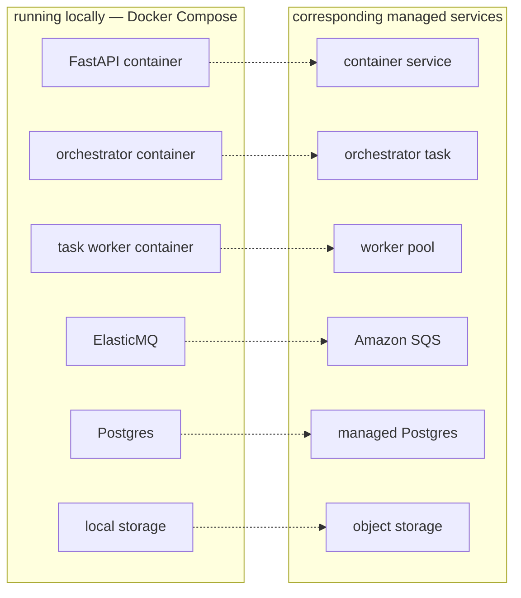

Two implementation choices support that mapping:

- **The queue adapter uses the SQS API.** Local development uses ElasticMQ, and
  the queue endpoint is configurable. Strict queue limits are enabled locally to
  catch some incompatibilities earlier.
- **Storage is behind an interface.** Local and S3-backed implementations are
  selected by configuration.

The API, orchestrator, and task worker are built from the same application image
but run as separate processes with separate entry points. This keeps process
boundaries visible during local development.


---

## 2. Notes on the use of AI

AI-assisted tools were used to accelerate portions of frontend implementation,
testing, documentation, refactoring, and debugging.

I designed and reviewed the architecture, state machines, service boundaries,
queue semantics, artifact model, validation strategy, execution model, and
failure-handling approach. Generated code was treated as a draft: it was read,
executed, tested, modified, and removed when it did not fit the system.

**The backend is the focus of the project.** The frontend exists to make the
workflow observable: upload data, ask a question, inspect a plan, approve it,
watch task progress, and read the result.

---

## 3. Data model and access boundaries

Authentication is implemented with AWS Cognito. In authenticated mode, the API
resolves a user identity from the supplied access token. Local development can
use a fixed dummy identity when authentication is disabled.

The current security model protects the HTTP boundary and scopes database access
through sessions. It is not a complete internal zero-trust design; the remaining
security work is described in Sections 3.6 and 7.4.

### 3.1 Core entities

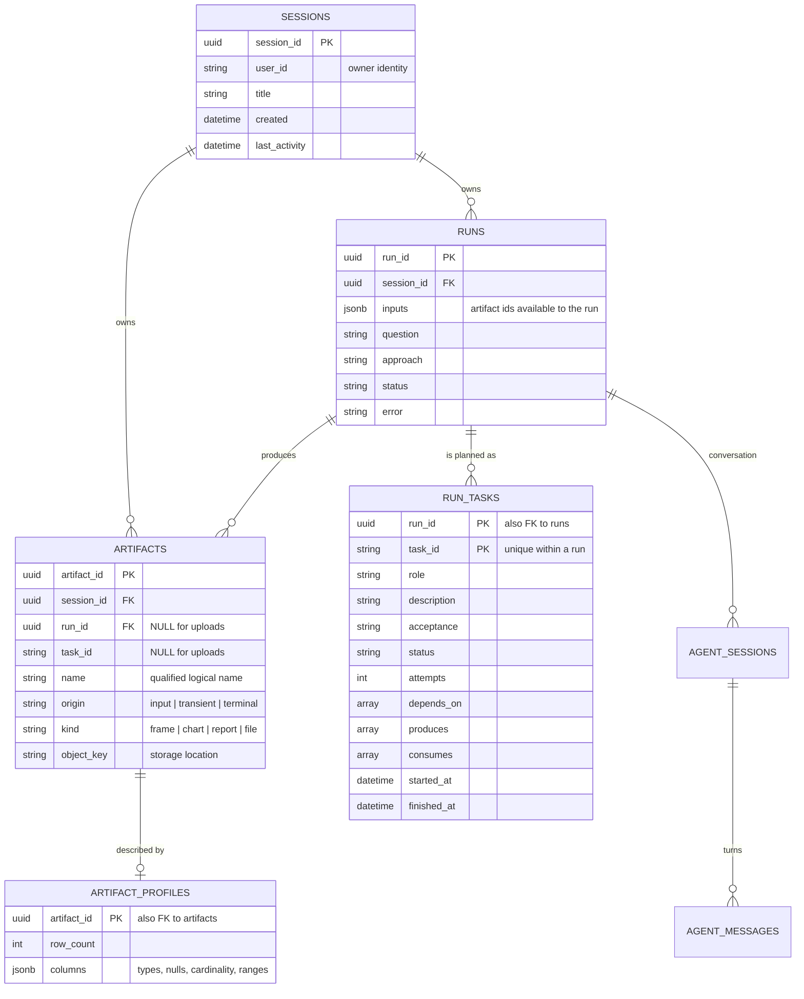

A plan is not stored twice. An earlier version kept both a JSON plan document and
`run_tasks` rows. The JSON column was removed; the task rows are now the persisted
representation of the plan and are reconstructed into model objects when needed.

### 3.2 The nesting, and the critical path

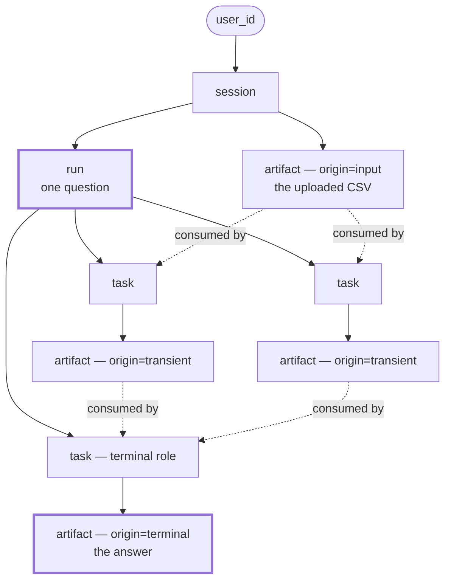

The critical path is **run → tasks**. A run is a question; tasks are how it gets
answered; `depends_on` is the only thing that orders them. Deleting a session is
one cascade plus one storage prefix delete.

### 3.3 Two names for one object: handle vs key

An artifact is addressed differently depending on who is asking, and the split is
deliberate.

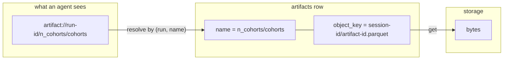

| | **Handle** | **Storage key** |
|---|---|---|
| Shape | `artifact://<run_id>/<name>` | `<session_id>/<artifact_id>.<ext>` |
| Built by | `ArtifactHandle.build` | `storage.key(...)`, validated |
| Who sees it | Agents, plans, task rows | Only `artifact_service` and storage |
| Stable across a retry? | Yes — the logical name remains stable while its bytes may be replaced | The same artifact id and key are reused unless the output kind changes |
| Purpose | A reference a model can reason about and never dereference | A location that deletes cleanly by prefix |

**Names are qualified by their producer.** A task called `n_cohorts` writing
`cohorts` produces `n_cohorts/cohorts`; an upload is named `input/sales`.
Because task ids are unique within a run, sibling tasks may use the same local
output name without colliding in persistent storage. The constraint is
`UNIQUE (session_id, run_id, name) NULLS NOT DISTINCT`.

When the same task rewrites an output during a review round or retry, the bytes
behind the existing logical name are replaced. Downstream tasks can therefore
continue referring to the same handle.

The handle is **opaque on purpose**. Plans and task rows carry logical references,
not filesystem paths or object-store keys. At execution time, the staging layer
resolves only the artifacts listed in the task's `consumes` field and exposes
them through `load(name)`.

This is application-level scoping, not a hardened filesystem security boundary.
Generated code still runs within the task worker's container and requires stronger
isolation before it should be treated as adversarial.

### 3.4 Wire shapes: message and delivery

These are not database rows. They are what travels on a queue.

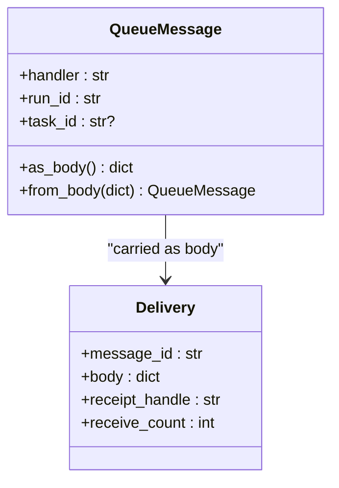

**`QueueMessage`** is one shape for every queue. `handler` names a worker role on
the tasks queue, and the orchestrator's own action on the runs queue. `task_id`
is absent for anything concerning a whole run.

**`Delivery`** is one *delivery* of a message, and the distinction matters:

- `receipt_handle` identifies **this delivery**, not the message. A redelivery
  carries a different one, and deleting requires the handle from the delivery you
  are actually finishing.
- `receive_count` is `1` on the first delivery. A value above one means an
  earlier delivery was not deleted. That may indicate a process crash, handler
  exception, visibility timeout, failed acknowledgment, or work that exceeded
  its visibility window.

### 3.5 The state machines

#### Workflow
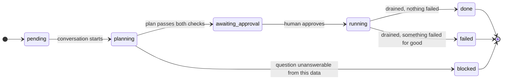

`blocked` is deliberately distinct from `failed`: nothing went wrong, the data
simply does not contain what was asked for. Collapsing the two would let a
planner's honest refusal read as a crash.

#### Task status
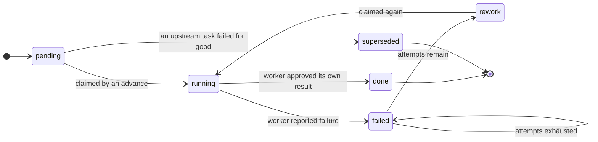

| Group | Members | Meaning |
|---|---|---|
| `DISPATCHABLE` | `pending`, `rework` | Eligible once dependencies are satisfied |
| `ACTIVE` | `running`, `validating` | In flight — never dispatch again |
| `TERMINAL` | `done`, `failed`, `superseded` | Nothing further will happen |

`validating` remains part of the task-status vocabulary, but the current analyst
worker performs result review while the persisted task remains `running`. It is
reserved for separating execution and validation into independently observable
states later.

`rework` exists as a state distinct from `pending` because a rejected task keeps
its satisfied dependencies — it needs another attempt, not re-derivation.
`superseded` marks work discarded because it consumed something that will now
never exist.

### 3.6 Identity: how a request becomes a `user_id`

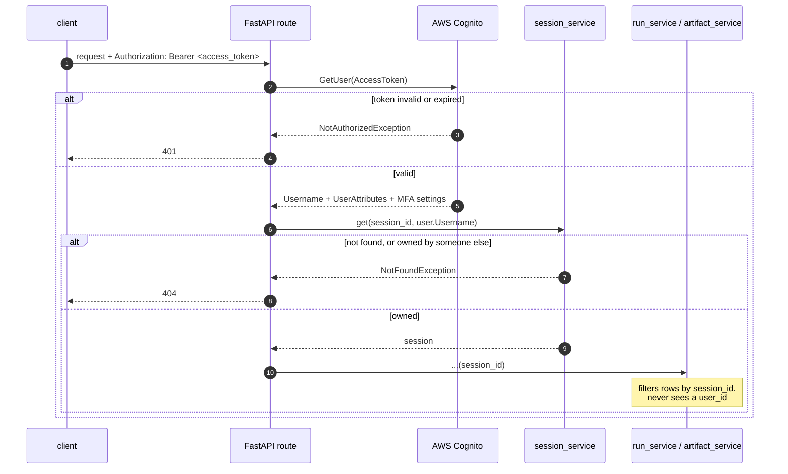

**How the gate is enforced:**

1. **`user_id` is never accepted from the caller.** It is not a body field, not a
   query parameter, not a header we read. It exists only as the return value of a
   validated token. A client cannot name another user because there is no
   parameter in which to name one.
2. **Ownership is checked in exactly one place.** `session_service.get(session_id,
   user_id)` is the only function in the codebase that compares a user to
   anything. A missing session and a session owned by someone else both raise the
   same `NotFoundException` and both surface as **404, never 403** — a 403 would
   confirm that the id exists, which is a membership oracle for anyone guessing
   UUIDs.
3. **Below that line, `session_id` is the capability.** `run_service` and
   `artifact_service` take a `session_id` and filter rows. They must not import
   `session_service` and must not reason about users. Once a route has resolved
   the session, the user is out of the picture — which is why every query is
   scoped by construction rather than by remembering to add a filter.

**`DISABLE_AUTH` is a local-development escape hatch.** With it set, `get_user`
returns a fixed dummy user and Cognito is never contacted, so the whole stack runs
with no AWS account. It must never be true in a deployed environment; it is the
single flag that turns the gate off entirely.

**What is still missing, and it is not small.** Everything above secures the
**edge**. Inside the system, trust is currently positional — a queue message is
believed because it arrived on an internal queue, and an artifact handle is
opaque but unauthenticated. A worker that receives `{"handler": "analyst",
"run_id": ..., "task_id": ...}` cannot verify who published it. On one VPC with a
private queue that is a defensible starting point; it is not a finished security
model.

The direction:

- **Sign messages crossing a process boundary.** An asymmetric signature (RSA or
  Ed25519) over the message body, with a **nonce and an expiry**, so a worker can
  verify the publisher was the orchestrator and reject replays. The nonce is the
  part that matters — without it a captured message is re-executable forever.

- **Separate credentials per role.** The sandbox child receives no database
  handles or cloud credentials and runs in a fresh subprocess with an allowlisted
  environment and isolated working directory. It still shares the task worker's
  container-level network and filesystem boundary; dedicated compute isolation
  remains future work. The workers around it do not yet have least privilege of
  their own.

---

## 4. Agents


The current system has four model-backed roles or review steps:

- a chat agent;
- a plan agent;
- a plan validator;
- execution roles for analysis and synthesis.

The orchestrator is not an agent. It advances persisted state according to task
statuses and dependencies.


### 4.1 Chat agent

The chat agent is the conversational entry point. It can inspect available input
artifacts through a small tool surface:

- `list_inputs`;
- `describe_input`;
- `sample_rows`;
- `column_values`;
- `use_inputs`.

It is instructed to inspect the data before making claims about its contents.
When the request is sufficiently specified, it calls `build_plan`.

Responses stream over server-sent events. Text deltas and tool-call lifecycle
events allow the client to show both the response and the actions taken while

### 4.2 The adversarial pair, with code in the middle

Planning is **not** one model call. It is a loop with a deterministic gate
between two models.

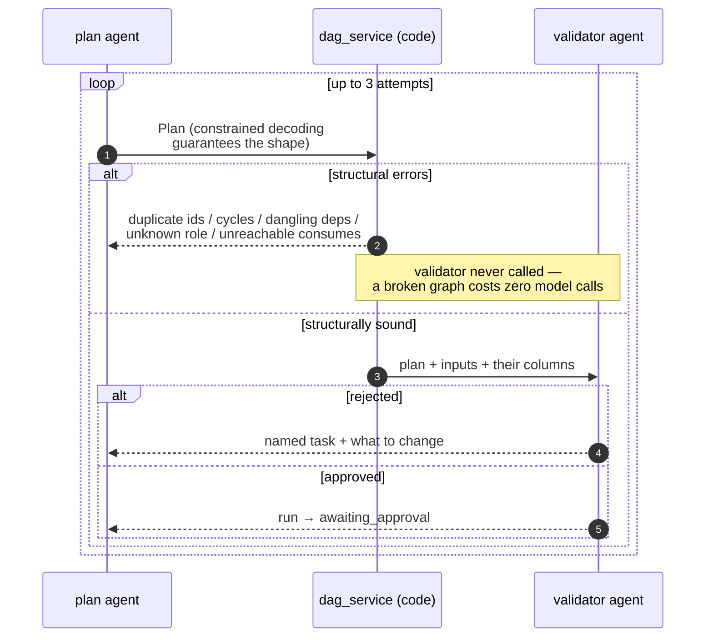

**Why code sits in the middle.** `dag_service.validate` is pure — no database, no
model, no framework — so it is exhaustively testable with hand-built inputs. It
checks what a model should never be trusted to check:

| Check | Failure it prevents |
|---|---|
| Duplicate task ids | Later checks assume uniqueness; artifact names would collide |
| Dangling dependencies | Models invent ids that were never emitted |
| Unknown roles | The orchestrator would have nothing to dispatch to |
| Cycles | Deadlock, and ancestry becomes meaningless |
| Unreachable `consumes` | A task waiting on an artifact nobody will ever produce |

Ordering is **cheapest-first**: the validator is only ever called on a plan that
already holds together, so a dangling dependency never costs a model call.

**Why validation is code, not a tool the agent calls.** A tool would be optional,
and it would see whatever draft it was handed rather than the answer that
actually comes back — so an agent could validate one graph and emit another. The
gate runs on `final_output`, outside the agent's reach.

**Why the validator exists at all.** Structure is not judgment. It cannot tell
you that a plan answers a *different* question than the one asked, that a task
depends on a column that isn't there, or that a task's description is too vague
to implement. Its rejection reason is the entire content of the next attempt's
correction prompt, so it is instructed to name the task and what to change.


### 4.3 What a plan looks like

The plan is a schema (`models/plan.py`), enforced by constrained decoding — the
*shape* is guaranteed, so validation only has to worry about semantics.

```jsonc
{
  "question": "Which region has the highest average revenue per unit?",
  "approach": "Compute revenue per unit per region, then take the maximum.",
  "nodes": [
    {
      "id": "calculate_average_revenue",
      "role": "analyst",
      "description": "Calculate the average revenue per unit for each region.",
      "acceptance": "one row per region, four rows",
      "depends_on": [],
      "consumes": ["input/sales"],
      "produces": ["average_revenue_per_region"]
    },
    {
      "id": "write_final_report",
      "role": "synthesizer",
      "description": "Summarize which region leads and by how much.",
      "acceptance": "names one region and cites the figure",
      "depends_on": ["calculate_average_revenue"],
      "consumes": ["average_revenue_per_region"],
      "produces": ["summary"]
    }
  ]
}
```

**`produces` / `consumes` are the load-bearing fields.** Without named
intermediate artifacts a plan collapses into fan-out/fan-in and its dependencies
are decorative. With them, the graph has real depth, a real reason to be walked,
and staging knows exactly what to put in front of each worker.

### 4.4 The roles

A worker **is** a module. Drop a file in `services/agents/roles/` exposing three
names and it exists — discovery is by `pkgutil`, there is no registry to keep in
step, and `WORKERS[role]` raising `KeyError` is the error handling.

```python
DESCRIPTION = "..."  # prose the planner reads when choosing a role
TERMINAL = False  # does this write the run's final answer?


async def handle(message: QueueMessage) -> TaskOutcome: ...
```

The planner's role list is generated from `DESCRIPTION`, so adding a worker
teaches the planner about it without editing any prompt.

#### analyst — write, run, review

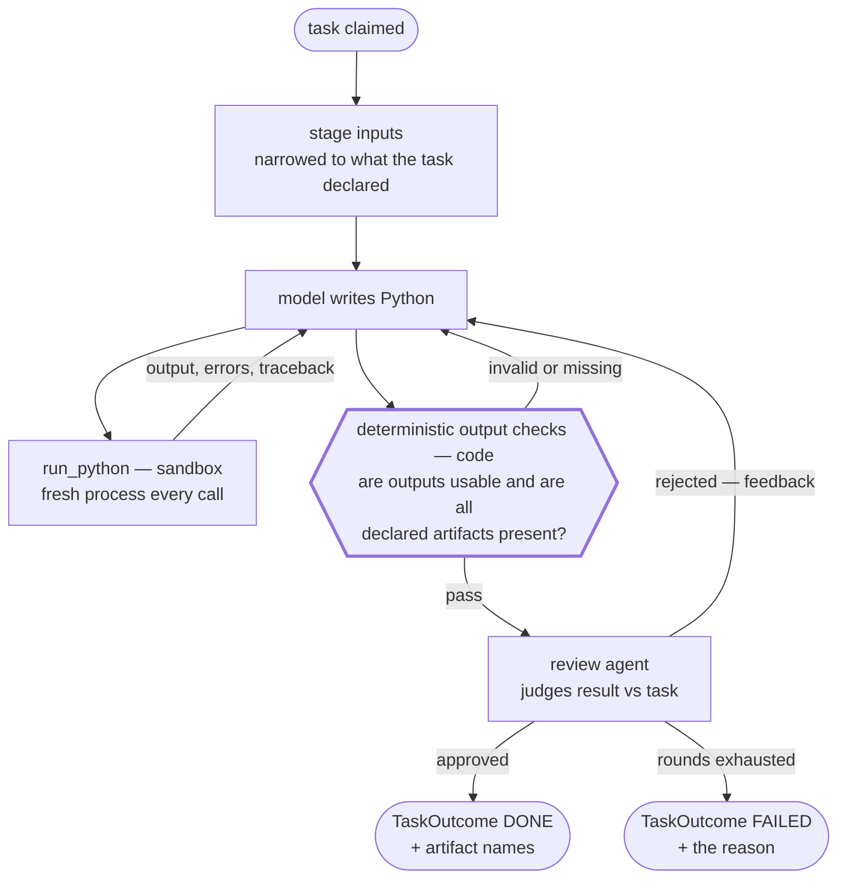

The model is given a small application surface: `pd`, `load(name)`,
`emit(name, value)`, and an output directory. Every execution starts in a fresh
subprocess with an isolated working directory and an allowlisted environment.
No database handles or cloud credentials are exposed. A DataFrame emitted becomes
a table, a dict becomes a chart specification, a string becomes text, and files
written to the output directory are collected by filename.

This is intended to contain accidental and poorly behaved generated code. It is
not a hardened boundary against a determined adversary because the subprocess
still shares the worker container's network and broader operating-system
boundary.

Two properties are stated to the model explicitly because they otherwise cause
silent wrong answers: every call is a **fresh process**, so nothing survives
between calls; and it is given the *whole* of each input, so it should look
before it computes.

Two deterministic gates run before semantic review.

First, every emitted output is checked before persistence.
`ExecutionResult.check()` rejects outputs that are missing, empty, all-null,
structurally degenerate, or otherwise unusable for their declared artifact kind.

Second, after the analyst finishes, the worker checks that every artifact named
in the task's `produces` field exists. This prevents a task from reporting
success while leaving downstream work permanently unable to run.

Only after those mechanical checks pass does the reviewer agent judge what code
cannot: whether the result answers the specified task, is plausible for the
available data, and satisfies the acceptance criterion.

Bounded by `MAX_REVIEW_ROUNDS = 2` and `MAX_TURNS = 10`. Past that it isn't
converging, and the queue's retry is the better mechanism.

The analyst worker invokes a separate reviewer agent before reporting success.
The reviewer cannot run code or redesign the analysis; it judges the persisted
result against the task and acceptance criterion. This is why there is no
separate critic node in the plan. A critic node was tried and removed: it doubled
graph size to re-check something the worker was better placed to review, having
actually seen the data.

#### synthesizer — draft, then check


The synthesizer role is marked `TERMINAL = True`, and the planner is instructed
to include one terminal task that depends on the required analytical work.
Deterministic enforcement of exactly one terminal role remains to be added to
DAG validation.

The faithfulness check is a second model reading the report against the results
it was given, and its note is stored alongside the report — the run's answer is
stored with the faithfulness review note.

#### Where the power is, and what is deliberately missing

The scaffolding is the achievement so far; the **library is not built yet**.

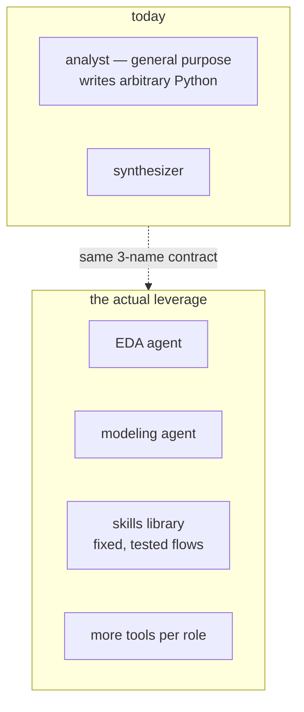

A general-purpose analyst writing arbitrary Python is the *weakest* version of
this. The power is in a **library of skills** — parameterized, tested flows a
planner selects rather than a model improvising — and in specialized roles with
richer tools. The contract is already there to hang them on. This is where the
work goes next.

---

## 5. The orchestrator

Approval is the execution boundary. The conversational planner and plan
validator have already made model calls, but no analysis task is dispatched
until a human has inspected and approved the task graph.

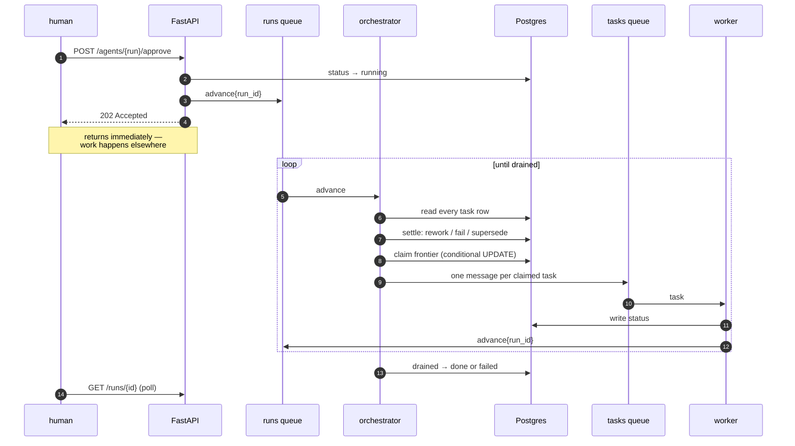

### 5.1 The one idea

**An advance message means "look at this run" — never "task 7 finished".**

It carries nothing but a run id. Whoever handles it rebuilds the entire picture
from the task rows. That single choice buys almost everything else:

| Property | Consequence |
|---|---|
| **Level-triggered** | Duplicate advances are cheap and normally idempotent — a redelivery generally costs another state read |
| **Stateless handler** | No state rides in the message and none is held by the handler |
| **State-reconstructing** | Any later advance rebuilds the decision from Postgres rather than relying on in-memory workflow state |
| **No callbacks** | A worker's completion *is* a message on the runs queue |

`advance` is a **handler, not a loop**: load state, make one decision, publish,
return. It never waits, and it makes **no model call at all**. What it does is
entirely determined by the task rows, which makes it deterministic and testable.

Mid-execution replanning is not yet implemented. It is intended as **automatic
graph improvement**: after active work drains, a separately dispatched replanner
would inspect failed, insufficient, or poorly decomposed work and propose a
replacement graph rather than embedding model behavior in the state-transition
handler.

Metering is likewise a core extension still in development. Planner, model,
sandbox, and worker activity will be attributed to tasks and runs so cost can be
observed during execution and eventually governed by budgets. Metering should
observe workflow transitions without becoming part of the scheduling decision.

### 5.2 One advance, in order

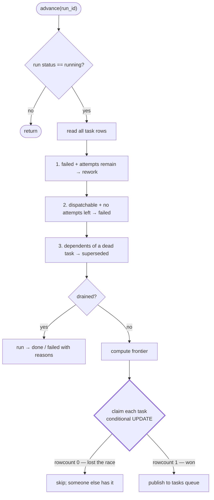

**Order matters.** A task can only be declared dead once it is out of attempts,
and its descendants can only be superseded once it is. Step 3 exists because
without it, dependents of a permanently failed task sit `pending` forever — not
terminal, so the run never finishes, and no further advance is coming to look at
them.

### 5.3 The claim is the lock

```sql
UPDATE run_tasks
   SET status = 'running', attempts = attempts + 1, started_at = ...
 WHERE run_id = ? AND task_id = ? AND status = <the status this advance read>
```

Two advances can be in flight for the same run — a duplicate delivery, or two
orchestrator processes. Both read task 7 as `pending`; both try to dispatch it.
Postgres serializes the two updates, the first flips the row, the second matches
**zero** rows and skips.

**No queue property is relied on to keep them apart.** Correctness comes from a
row-level compare-and-set. Visibility timeouts may reduce overlapping deliveries,
but they do not provide ownership. The conditional `WHERE` clause is what makes
concurrent orchestrator claims safe. This is the whole of what makes horizontal
scaling of the orchestrator sound.
### 5.4 Queue layout

| | `runs` queue | `tasks` queue |
|---|---|---|
| Body | `{handler, run_id}` | `{handler, run_id, task_id}` |
| Meaning | Re-evaluate a run | Execute one task |
| Type | Standard | Standard |
| Visibility timeout | 30 seconds | 300 seconds |
| Long poll | 20 seconds | 20 seconds |
| DLQ threshold | 5 deliveries | 3 deliveries |

The tasks queue is standard rather than FIFO because dependency ordering is
already represented in the DAG. Tasks in the same eligible frontier are intended
to run independently.

The current 300-second task visibility timeout is suitable only while individual
handler executions remain within that operational assumption. Tasks that can run
longer require visibility extension or a separate lease/heartbeat mechanism.
Without it, a task may be redelivered while the original worker is still active.


### 5.5 Acknowledgment behavior

A consumer deletes a message only after its handler returns successfully. If the
handler raises, the message is left on the queue and may be delivered again after
the visibility timeout. Repeated failures eventually move it to the configured
DLQ.

The task consumer requests another run advance after it records a handled
outcome, including a failed outcome. This gives the orchestrator an opportunity
to retry the task, supersede descendants, dispatch newly eligible work, or close
the run.

An unknown worker role is treated as a task failure rather than silently deleting
the message and leaving the run unchanged.

### 5.6 Known delivery and recovery gaps

The current implementation has two important database-to-queue gaps:

1. **Claim then publish.** The orchestrator marks a task `running` and then
   publishes its task message. A process exit between those operations can leave
   a running task with no corresponding queue message.
2. **Outcome then advance.** A worker writes the task outcome and then publishes
   an advance message. A process exit between those operations can leave a run
   with updated task state but no message that causes the orchestrator to inspect
   it again.

There is currently no sweeper or transactional outbox. A run can therefore become
stranded even though all state required to recover it remains in Postgres.

At-least-once delivery also means that a task message may execute more than once.
The current message does not carry an attempt or lease token, and the worker does
not condition its final write on still owning the active attempt. A delayed or
overlapping delivery may therefore execute again or commit after newer work.
Attempt-scoped commits and leases are required to close that gap.

A complete recovery design should include some combination of:

- a transactional outbox for queue publications;
- leases or attempt tokens for dispatched work;
- visibility extension for long-running handlers;
- idempotent artifact commits associated with an attempt;
- a sweeper that re-examines stale active tasks and running runs with no active
  progress;
- reconciliation of DLQ entries with persisted run state.

The present implementation demonstrates the main task-state transitions and
conditional claims, but these gaps must be closed before treating it as a durable
production workflow engine.


---

## 6. Code layout

Two deployables from one repo; three processes from one image.

```
agentics/
├── backend/
│   ├── server/            FastAPI — the only process that talks to a human
│   │   └── routers/       sessions · artifacts · runs · agents · health
│   ├── workers/           the processes that talk to queues
│   │   ├── consumer.py      the loop — ONE copy, shared by both
│   │   ├── orchestrator.py  python -m workers.orchestrator  → runs queue
│   │   └── task.py          python -m workers.task          → tasks queue
│   ├── services/          the logic. no framework, no HTTP
│   │   ├── agents/          planner · tools · roles/{analyst,synthesizer}
│   │   ├── dag_service.py       PURE — topology
│   │   ├── profile_service.py   PURE — dataframe → profile
│   │   ├── run_service.py       IO — runs and task rows
│   │   ├── artifact_service.py  IO — the one public write
│   │   ├── session_service.py   IO — the ONLY ownership check
│   │   └── orchestrator_service.py
│   ├── external/          everything that talks to something outside
│   │   ├── postgres · queue · storage/{local,s3} · sandbox · cognito · llm
│   ├── models/            wire shapes, db/ for tables
│   └── tests/             unit (no containers) + integration/ (skips w/o pg)
└── client/                Next.js — upload · ask · approve · watch · read
```


### Servers vs consumers

| | server | consumer |
|---|---|---|
| Entry | `uvicorn` | `python -m workers.{orchestrator,task}` |
| Triggered by | HTTP | queue message |
| Talks to | humans | queues |
| Scales on | request rate | queue depth |

`consumer.py` holds the loop exactly once. A consumer *is* a queue name and a
handler; long polling, startup, acknowledge-on-success-only, and SIGTERM handling
are identical for all of them and live in one place. Each consumer module is a
handler plus a one-line entrypoint.

### `external/` and the boot rule

Every module in `external/` exposing a module-level `ExternalService` is
discovered by `pkgutil` and started by **every process**, because a service that
fails anywhere is a problem everywhere. There is no per-process subset and no
registry — dropping a module in the directory is the whole of adding one.

### Ownership lives in exactly one service

`session_service.get(session_id, user_id)` is the only place a user is checked
against anything. `run_service` and `artifact_service` take a `session_id` and
filter rows; they must not import `session_service` or reason about users. Routes
resolve the session once and pass the id down.

---

## 7. What's next

Ordered roughly by how much each one is currently hurting.

### Reliability

- **A sweeper.** The recovery gaps described in §5.6. This is what separates
  deployable from demo.
- **More nuanced exceptions.** Right now too much collapses into a generic
  service-layer error, which means the orchestrator's retry decision is coarser
  than it should be. A model refusing a task, a sandbox timing out, a transient
  database error, and a genuinely impossible task should not all be one shape —
  only some of them are worth retrying, and the retry ladder can't currently
  tell them apart.
- **Automatic graph improvement through mid-execution replanning.** This is a
  core capability still to be built: never replace a moving graph and never
  cancel active work. Set a run-level `replan_pending` flag, dispatch nothing
  while `ACTIVE` tasks remain, and let the last worker's advance trigger a
  separately dispatched replanner. The replanner should use failed, insufficient,
  or poorly decomposed work to propose a better graph. The flag-set must *fall
  through* to the drain check, or a lone failure hangs the run. Retry exhaustion,
  not a single failure, is what triggers it.

### Agents

- **A skills library.** Fixed, parameterized, tested flows the planner selects
  instead of a model improvising pandas. This is the single biggest lever.
- **Specialized roles** — an EDA agent and a modeling agent, rather than one
  general analyst.
- **Better parallelization.** The planner now has a decomposition criterion, but
  the axis it decomposes along is still emergent rather than expressed. Fan-out
  across segments, files, or features should be a first-class shape.
- **Preserve qualified names during staging.** Persistent artifact names include
  their producer, but `artifact_service.stage()` currently strips that prefix.
  Consuming both `task_a/result` and `task_b/result` would stage each as `result`,
  allowing one to overwrite the other. The sandbox input contract needs
  collision-free local aliases.

### Data and output

- **A formal data quality report.** The profile is currently types, nulls,
  cardinality, and ranges. It should be a real DQR — and, more importantly, one
  with **interpretation** attached, so downstream agents inherit judgment about
  the data rather than raw statistics.
- **Real output handling.** Charts are stored as specifications and nothing
  renders them; frames are parquet but the answer that reaches the user is plain
  text. Charts, tables, and downloadable parquet should all be first-class in the
  report.
- **Persist accepted execution code.** Outputs are produced by executed Python,
  but the successful analyst conversation is cleared and the accepted code is
  not retained as a first-class artifact. Persisting the final accepted program
  would support genuine result-to-code provenance.

### Security

- **Local JWT verification.** Replace the per-request `GetUser` introspection
  call with JWKS-cached RS256 verification in-process, keeping introspection or a
  deny list for revocation. §3.6 has the trade-off in full.
- **Sign internal messages.** Asymmetric signature plus nonce and expiry on
  anything crossing a process boundary, so a worker can verify the publisher and
  reject replays instead of trusting the network.
- **Capability-scoped artifact handles**, so access fails closed on a bad token
  rather than relying on every query remembering to scope itself.
- **Dedicated execution isolation.** Move generated code into a container or
  purpose-built compute sandbox with explicit network, filesystem, CPU, memory,
  and process limits.

### Infrastructure

- **Dispatch the sandbox to dedicated workers.** Executing generated code
  currently happens inside the task worker. It should be its own pool, sized and
  resourced for the job — heavier CPU, GPU where modeling needs it — so that
  compute-hungry execution scales independently of orchestration and cannot
  starve it.
- **Metering and budgets.** Attribute model tokens and cost, sandbox duration,
  retries, and worker time to each task and run as execution happens. Surface the
  cumulative total during a run and use it later for alerts, approval estimates,
  and enforceable budget limits. This is a core capability still in development.
- **Complete and deploy the managed topology.** The current CDK covers part of
  the environment, but does not yet provision the SQS queues or separate
  orchestrator and task-worker services represented in this design.

---

## 8. The tradeoff being made

This architecture is **more machinery than a single-CSV question needs**. That is
the deliberate cost. Every piece of it — the claim, the level-triggered advance,
the DLQ, the opaque handle, the pure/IO split — exists because of what happens
when work is parallel, long-running, and has to survive a process dying.

The honest summary: for one person analyzing one file, a chat tool wins. For an
organization running the same question across a thousand of them, with persisted
evidence and a human gate before execution, this is the shape the problem
actually has.
