# Agentics — Design

> A multi-agent orchestration system, demonstrated on exploratory data analysis.
> The analysis is the **load**. The orchestration is the **product**.

---

## 1. What this is, and why

### 1.1 The problem

When an organisation decides to automate a function with agents — a reporting
team, a reconciliation desk, a support triage queue — the demo is easy and the
system is hard. The demo is a model with a tool. The system is everything
underneath it:

1. **Decomposition.** Turning one request into units of work small enough to
   check, and expressing what each unit needs from the others.
2. **Scoping.** Deciding what each unit is allowed to see, and enforcing that
   rather than asking a prompt nicely.
3. **Distribution.** Running independent units at the same time, on different
   machines, without them corrupting each other's state.
4. **Verification.** Proving a result before anything downstream trusts it, when
   the thing that produced it can be confidently wrong.
5. **Recovery.** Surviving a worker that dies mid-task, a queue that delivers
   twice, and a deploy that restarts every process at once.
6. **Control.** Putting a human in front of the expensive part, before the money
   is spent rather than after.

None of those six are model problems. They are distributed-systems problems that
happen to have a model inside them, and they are the same six whether the agents
write pandas, file tickets, or reconcile invoices.

This project builds those six. Choosing a domain is choosing a **test load** to
exercise them, and the choice was deliberate.

### 1.2 Why build it from scratch

The system deliberately does not use a managed agent platform, a hosted workflow
engine, or MCP servers for the parts it is trying to demonstrate. That is not
ideology, and it is not a claim that those tools are bad — it is that **you learn
where a system breaks by building the part that breaks.**

Using an off-the-shelf orchestrator would have skipped precisely the problems
worth understanding. The bugs this project actually produced — a run stranded
because a dedup id was unique in the present but not across history, tasks
orphaned when a worker died between writing status and publishing its
notification, an analyst confidently summing a column it was never granted —
are invisible when a vendor owns that layer. They are also exactly the failures
that a team running this in production would have to diagnose themselves.

There is a second reason, and it is the one that matters commercially: **at
sufficient scale or sufficient integration depth, the ready-made option is often
not available.**

| Constraint | Why the managed path closes |
|---|---|
| **Observability tooling leaks** | Hosted tracing and evaluation platforms commonly log full prompts and completions to their own servers — which is a data-egress event, not a debugging convenience ([Prem AI](https://blog.premai.io/ai-data-residency-requirements-by-region-the-complete-enterprise-compliance-guide/)) |
| **Warehouse-bounded analytics** | The managed analytics agents are scoped to their own platform's data. Snowflake Cortex Analyst works only against Snowflake; Databricks Genie is structured-data only, caps a Genie Space at 30 tables, and needs a federation layer for anything outside Databricks ([Colrows](https://colrows.com/blogs/cortex-analyst-vs-genie/), [Infinisynapse](https://infinisynapse.com/en/blog/databricks-genie)) |
| **Internal systems** | The interesting workloads read from services that exist only inside the company. Nothing hosted has a connector for a bespoke internal API, so the integration is yours to write regardless |

So the ceiling on the managed path is real, and it is reached by exactly the
workloads that are worth automating: high volume, internally integrated,
compliance-bound. Building it once, by hand, is how you find out what that ceiling
costs.

### 1.3 Why analytics is the right test load

Two claims, both supportable.

**First: it is under-represented relative to how hard it is.** Agent evaluation
has concentrated on software engineering. SWE-bench alone spans 2,294
issue-commit pairs across 12 Python repositories and has become the default
yardstick. The data-analysis equivalents are far younger and far smaller —
DSBench collects 540 tasks from ModelOff and Kaggle
([OpenReview](https://openreview.net/forum?id=DSsSPr0RZJ)), and DABstep offers
~450 multi-step tasks derived from a financial analytics platform
([arXiv](https://arxiv.org/html/2506.23719v1)). The literature on those
benchmarks is explicit that prior evaluation leaned on synthetic tasks,
oversimplified scoring, or subjective judgement. That gap is the opportunity: the
problem is not solved, and the evaluation apparatus is still being built.

**Second: the failure mode is honest rather than flattering.**

| Property | Why it matters here |
|---|---|
| **Code either runs or it doesn't** | The validation layer gets real ground truth to stand on, instead of an LLM grading an LLM |
| **But running ≠ correct** | A `groupby` on the wrong column runs perfectly and answers the wrong question. Deterministic gates are therefore *provably* insufficient — which forces a layered validation stack rather than a hand-wave |
| **Naturally parallel** | One question across many segments, files, or cohorts is fan-out that is not decorative |
| **Naturally long-running** | Minutes today; hours once a task pulls a real dataset, fits a model, or fans out across hundreds of segments |

That last row is the hinge. A request lasting minutes to hours, spanning six
processes, cannot live in one HTTP handler's memory. Everything that makes this
architecture necessary — retries, claims, stranded work, partial failure,
resumption after a deploy — only becomes a real problem **once the work outlives
the request that started it.** A system that answers in 200ms never has to solve
any of it.

### 1.4 What this deliberately is not

**It does not compete with hosted analysis tools on the interactive
single-file case.** For one analyst exploring one CSV in a chat window, ChatGPT's
data analysis mode, Cortex Analyst, or Genie are better, and this architecture is
overkill. Saying otherwise would invite the obvious objection and deserve it.

The dividing line is not capability, it is shape:

| | Hosted chat analytics | This |
|---|---|---|
| Unit of work | One question, one session | A task graph, many workers |
| Concurrency | One conversation at a time | Independent tasks dispatched in parallel |
| Duration | Seconds to a minute | Minutes to hours, across processes |
| Failure | Ask again | Retry, rework, supersede, replan |
| Spend control | After the fact | Human approves the plan first |
| Audit | The transcript | Every claim traced to code, artifact, and reviewer verdict |
| Data reach | The vendor's platform | Wherever you can write a reader for |

It is also **not an agent framework**, and not trying to be. The useful
distinction from the orchestration literature: if you can draw the flowchart in
advance you want a workflow engine; if the model decides the next step you want
an agent runtime — and conflating them is where teams get into trouble, "asking
a scheduler to behave like a runtime, or an agent framework to behave like a
database" ([Datum Labs](https://medium.com/datumlabs/orchestration-showdown-airflow-vs-dagster-vs-temporal-in-the-age-of-llms-758a76876df0)).

This system sits deliberately in between, and is explicit about which half is
which: **the model decides the plan; code executes it.** The planner is a model
because decomposition is judgement. The orchestrator is code — it makes no model
call at all — because scheduling, parallelism, and termination fall out of
`depends_on` for free, and making them prompt-dependent would be strictly worse.


### 1.5 Deployment posture

Built and tested locally; **designed throughout as if already deployed**. Nothing
is in-process that would have to be pulled apart later.

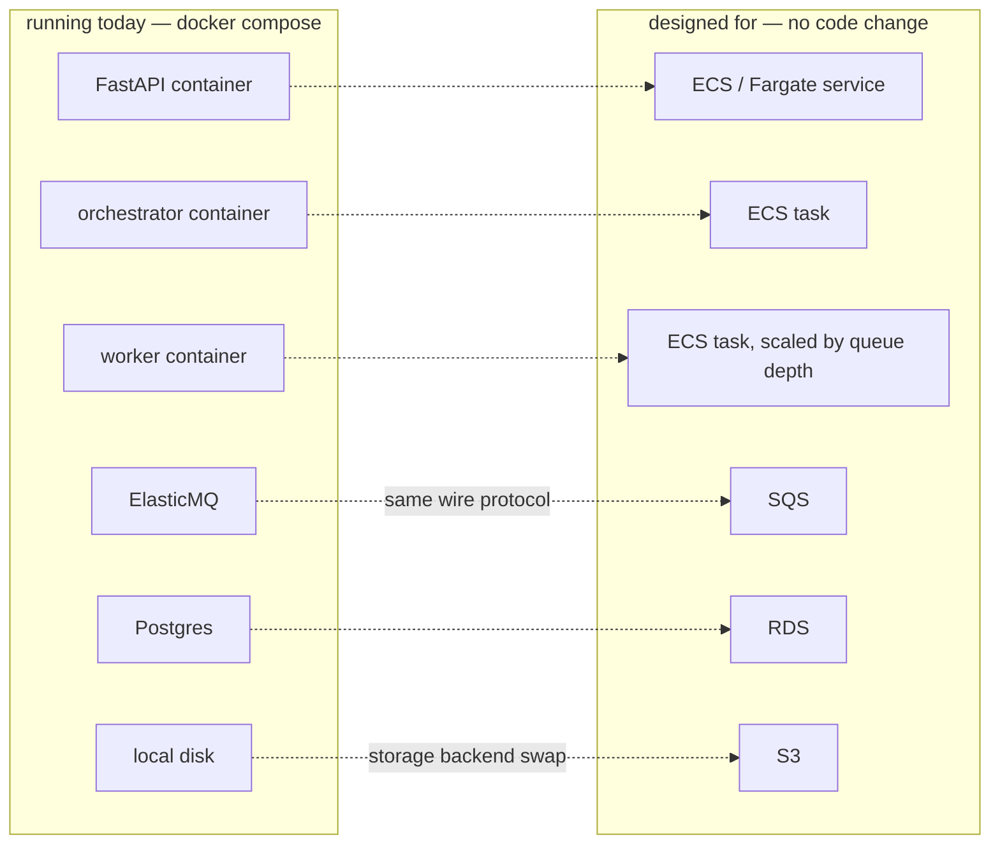

Two decisions make that arrow honest rather than aspirational:

- **ElasticMQ speaks the real SQS protocol.** Local and deployed differ by an
  endpoint URL. `sqs-limits = strict` in the config, so it rejects what real SQS
  rejects — the local environment says *no* in the same places production does.
  An in-memory queue would have been the tidier-than-production environment that
  has burned this project before.
- **Storage is an interface with two implementations** (`local`, `s3`) already
  written, selected by config.

Every process runs from the same image and boots every external service, so
there is no "works in the API but not in the worker" class of bug.

---

## 2. Notes on the use of AI

Stated plainly, because a project that hides this is less interesting
than one that doesn't.

| Area | How AI was used |
|---|---|
| **Documentation** | USed for editing this docuemnt, and generating docstrings and code comments |
| **Tests** | Heavily. Test generation, then reviewed and pruned by hand |
| **Frontend** | Heavily. It is deliberately not where the effort goes |
| **Backend architecture** | Directed by hand. Decisions, boundaries, and the queue design are mine; implementation is collaborative when it makes sense|

The focus is the **backend**. The frontend exists to make the backend
demonstrable — upload, ask, approve, watch, read — and gets attention when there
is time left over.

**This is a work in progress.** Section 8 is not a wish list; it is the list of
things currently known to be missing or weak.

---

## 3. Data and schemas

Authentication is implemented using **Cognito**. `user_id` is fetched from the `JWT` token supplied over request header. During local runs, a dummy `user_id` is used. However, the data design assumes this field a reliable security token to validate data-access permissions. Indeed, a real system will require more authentication gates. This is a task for the future and, for now, we will center security around the `JWT`'s `user_id`

### 3.1 Core entities

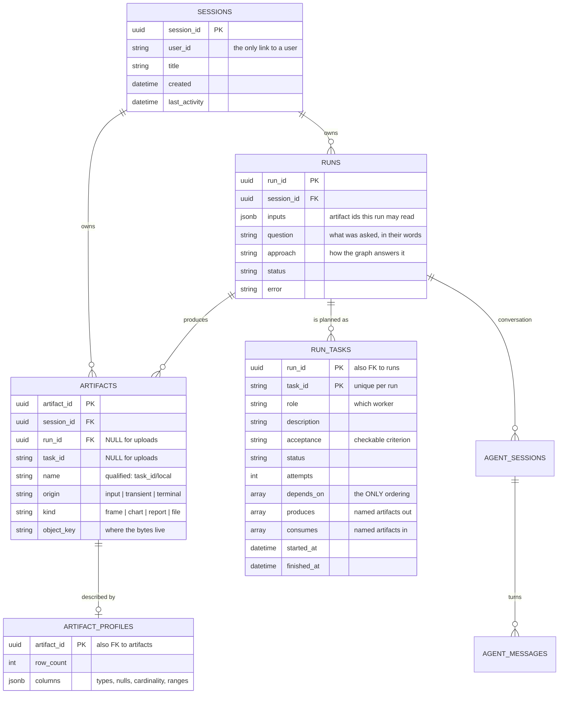


**There is no stored plan.** `runs.plan` was once a JSONB column holding the same
nodes the `run_tasks` rows already held. One representation per concept: **the
rows are the plan**, and a node is rebuilt from a row on read.

### 3.2 The nesting, and the critical path


The critical path is **run → tasks**. A run is a question; tasks are how it gets
answered; `depends_on` is the only thing that orders them. Deleting a session is
one cascade plus one storage prefix delete.

### 3.3 Two names for one object: handle vs key

An artifact is addressed differently depending on who is asking, and the split is
deliberate.

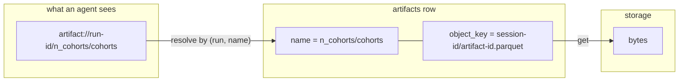

| | **Handle** | **Storage key** |
|---|---|---|
| Shape | `artifact://<run_id>/<name>` | `<session_id>/<artifact_id>.<ext>` |
| Built by | `ArtifactHandle.build` | `storage.key(...)`, validated |
| Who sees it | Agents, plans, task rows | Only `artifact_service` and storage |
| Stable across a re-plan? | Name is; the object behind it may be replaced | No — a new object, a new id |
| Purpose | A reference a model can reason about and never dereference | A location that deletes cleanly by prefix |

**Names are qualified by their producer.** A task called `n_cohorts` writing
`cohorts` produces `n_cohorts/cohorts`; an upload is `input/sales`. Uniqueness is
then free — task ids are already unique per run, so two tasks cannot collide, and
a re-plan's names are automatically distinct from the previous plan's. The
constraint is `UNIQUE (session_id, run_id, name) NULLS NOT DISTINCT`; the NULLS
clause is load-bearing, since it is what makes the constraint bind uploads at all.

Because a qualified name contains a slash, any route addressing one needs a
`{name:path}` parameter.

The handle is **opaque on purpose**. An agent receives a reference, not bytes and
not a path. It cannot read outside what its task declared, and it cannot be
prompt-injected into constructing a key, because it never constructs keys
paths

### 3.4 Wire shapes: message and delivery

These are not database rows. They are what travels on a queue.

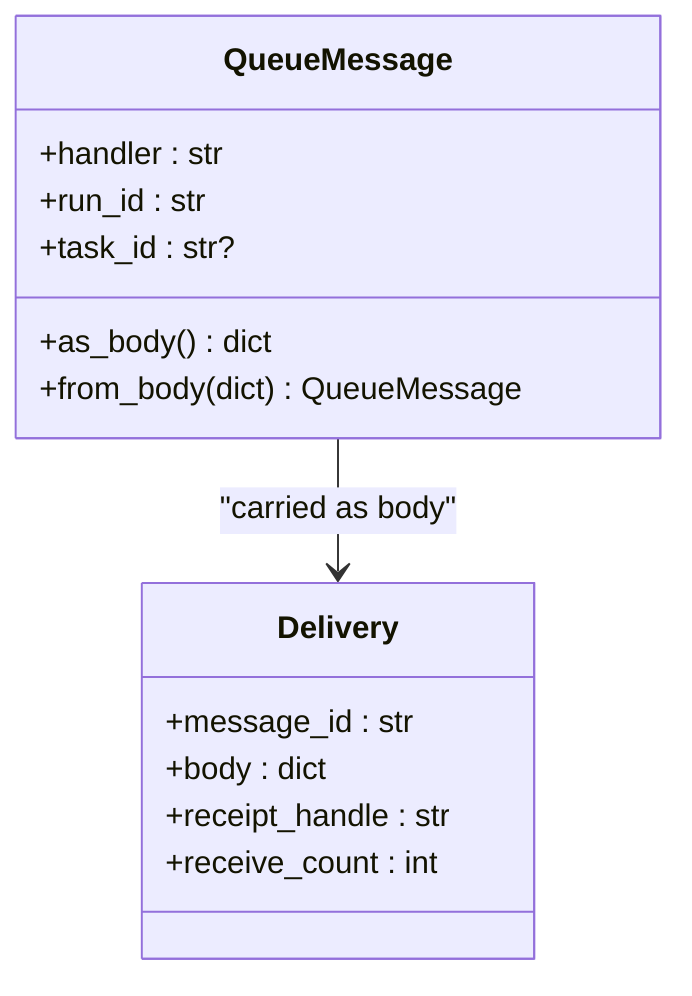

**`QueueMessage`** is one shape for every queue. `handler` names a worker role on
the tasks queue, and the orchestrator's own action on the runs queue. `task_id`
is absent for anything concerning a whole run.

**`Delivery`** is one *delivery* of a message, and the distinction matters:

- `receipt_handle` identifies **this delivery**, not the message. A redelivery
  carries a different one, and deleting requires the handle from the delivery you
  are actually finishing.
- `receive_count` is `1` on first delivery, so **`> 1` means a previous consumer
  took this and never deleted it** — the signal that a worker died mid-task.

### 3.5 The state machines

#### Workflow
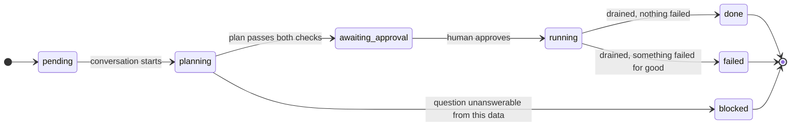

`blocked` is deliberately distinct from `failed`: nothing went wrong, the data
simply does not contain what was asked for. Collapsing the two would let a
planner's honest refusal read as a crash.

#### Task status
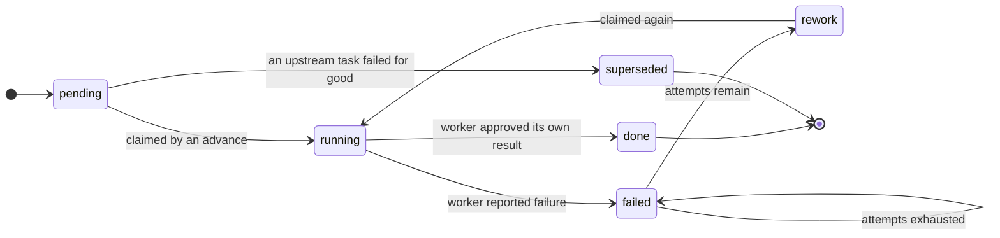

| Group | Members | Meaning |
|---|---|---|
| `DISPATCHABLE` | `pending`, `rework` | Eligible once dependencies are satisfied |
| `ACTIVE` | `running`, `validating` | In flight — never dispatch again |
| `TERMINAL` | `done`, `failed`, `superseded` | Nothing further will happen |

`rework` exists as a state distinct from `pending` because a rejected task keeps
its satisfied dependencies — it needs another attempt, not re-derivation.
`superseded` marks work discarded because it consumed something that will now
never exist.

### 3.6 Identity: how a request becomes a `user_id`

Every diagram above hangs off `sessions.user_id`. This is where that string comes
from, and why it can be trusted once it exists.

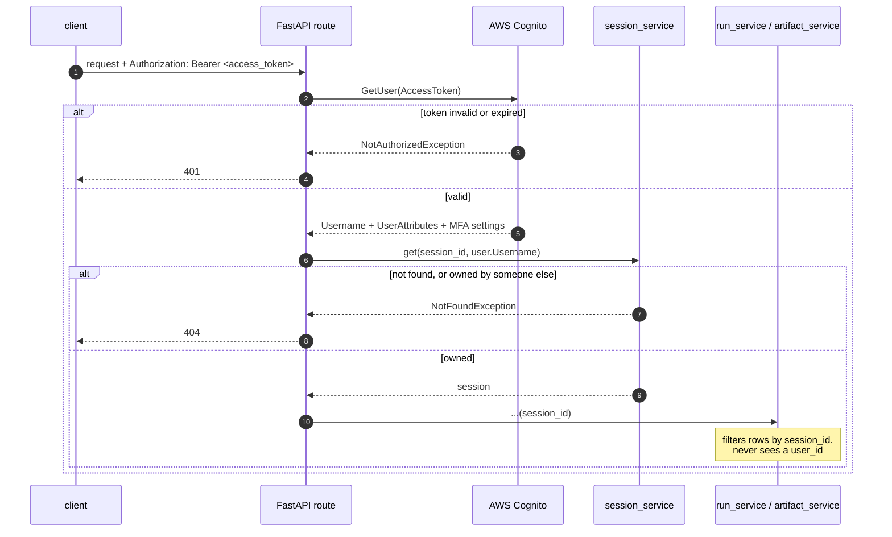

**What the token buys us.** The client sends a Cognito **access token** as a
bearer credential. `CognitoService.get_user` extracts it and calls
`cognito-idp:GetUser`, which returns a `CognitoUser`: `Username`, plus
`UserAttributes` (email, sub, and whatever else the pool is configured to hold),
`MFAOptions`, `PreferredMfaSetting`, and `UserMFASettingList`. Only `Username` is
used — it becomes the `user_id` written on every session.

The current implementation performs **token
introspection**, not local JWT verification. It does not parse the token, read
its `kid`, fetch the pool's JWKS, or check `exp`/`aud`/`iss` itself. It hands the
token to Cognito and lets Cognito decide, which means an invalid or revoked token
is caught immediately and correctly — but every authenticated request costs a
network round trip to AWS, and the API's p99 latency becomes the auth service's
p99 latency, because they are now the same number.

The standard alternative is local verification: fetch the pool's JWKS once, cache
the signing keys by `kid`, and verify the RS256 signature and claims in-process,
refreshing on a cache miss so the issuer can rotate keys without breaking live
traffic. That removes the round trip entirely, at the cost of a token staying
valid until it expires. Most high-traffic systems converge on a hybrid: local
verification on the hot path, introspection reserved for high-value operations or
backed by a revocation list ([MojoAuth](https://mojoauth.com/blog/token-introspection-vs-jwt-verification-at-scale)).

For a system whose requests take minutes to hours, one auth round trip is
genuinely noise — so introspection is the right call *for now*, and the reason is
worth writing down rather than leaving as an accident.

**How the gate is enforced.**

1. **`user_id` is never accepted from the caller.** It is not a body field, not a
   query parameter, not a header we read. It exists only as the return value of a
   validated token. A client cannot name another user because there is no
   parameter in which to name one.
2. **Ownership is checked in exactly one place.** `session_service.get(session_id,
   user_id)` is the only function in the codebase that compares a user to
   anything. A missing session and a session owned by someone else both raise the
   same `NotFoundException` and both surface as **404, never 403** — a 403 would
   confirm that the id exists, which is a membership oracle for anyone guessing
   UUIDs.
3. **Below that line, `session_id` is the capability.** `run_service` and
   `artifact_service` take a `session_id` and filter rows. They must not import
   `session_service` and must not reason about users. Once a route has resolved
   the session, the user is out of the picture — which is why every query is
   scoped by construction rather than by remembering to add a filter.

**`DISABLE_AUTH` is a local-development escape hatch.** With it set, `get_user`
returns a fixed dummy user and Cognito is never contacted, so the whole stack runs
with no AWS account. It must never be true in a deployed environment; it is the
single flag that turns the gate off entirely.

**What is still missing, and it is not small.** Everything above secures the
**edge**. Inside the system, trust is currently positional — a queue message is
believed because it arrived on an internal queue, and an artifact handle is
opaque but unauthenticated. A worker that receives `{"handler": "analyst",
"run_id": ..., "task_id": ...}` cannot verify who published it. On one VPC with a
private queue that is a defensible starting point; it is not a finished security
model.

The direction:

- **Sign messages crossing a process boundary.** An asymmetric signature (RSA or
  Ed25519) over the message body, with a **nonce and an expiry**, so a worker can
  verify the publisher was the orchestrator and reject replays. The nonce is the
  part that matters — without it a captured message is re-executable forever.

- **Separate credentials per role.** The sandbox already runs with no network, no
  credentials, and no database. The workers around it do not yet have least
  privilege of their own.

---

## 4. Agents

Four agents, and **the orchestrator is not one of them**. Scheduling,
parallelism, and termination fall out of `depends_on` for free; making them
prompt-dependent would be strictly worse.

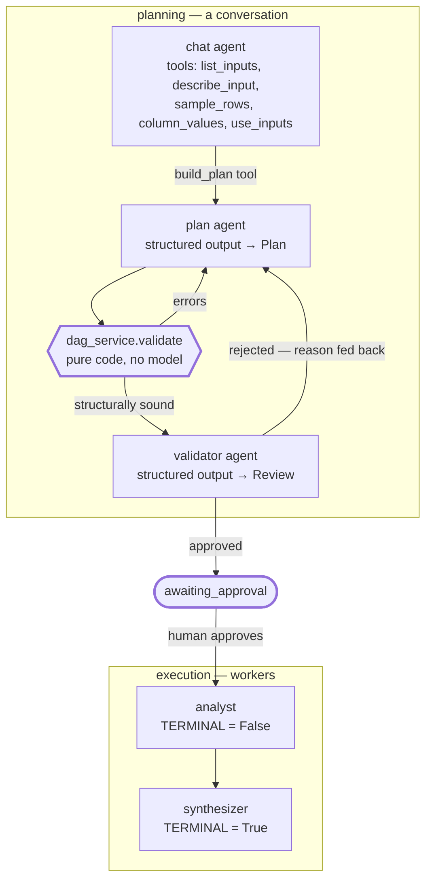

### 4.1 The chat agent

The conversational surface. It has the data tools and is told to look at the data
before saying anything about it, because guessing is worse than asking. When it
knows what the user wants, it calls `build_plan` — which is a *tool*, so
replanning is just calling it again.

Streaming is SSE: one `data:` frame per text delta, plus tool-call lifecycle
events so the UI can show what it is doing.

### 4.2 The adversarial pair, with code in the middle

Planning is **not** one model call. It is a loop with a deterministic gate
between two models.

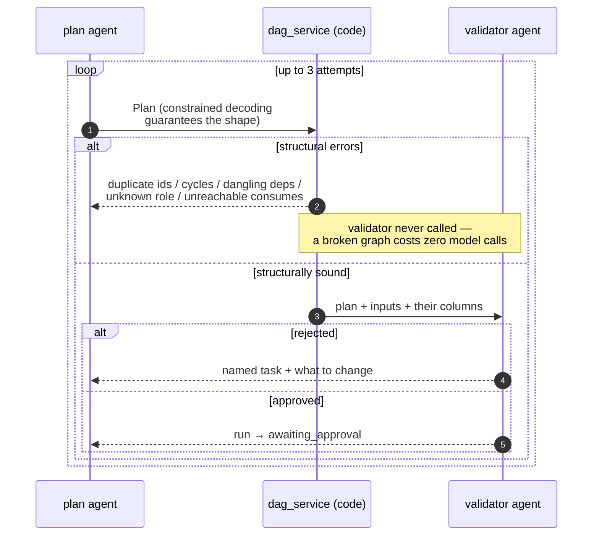

**Why code sits in the middle.** `dag_service.validate` is pure — no database, no
model, no framework — so it is exhaustively testable with hand-built inputs. It
checks what a model should never be trusted to check:

| Check | Failure it prevents |
|---|---|
| Duplicate task ids | Later checks assume uniqueness; artifact names would collide |
| Dangling dependencies | Models invent ids that were never emitted |
| Unknown roles | The orchestrator would have nothing to dispatch to |
| Cycles | Deadlock, and ancestry becomes meaningless |
| Unreachable `consumes` | A task waiting on an artifact nobody will ever produce |
| Terminal role present, exactly once | A run with no answer, or two of them |

Ordering is **cheapest-first**: the validator is only ever called on a plan that
already holds together, so a dangling dependency never costs a model call.

**Why validation is code, not a tool the agent calls.** A tool would be optional,
and it would see whatever draft it was handed rather than the answer that
actually comes back — so an agent could validate one graph and emit another. The
gate runs on `final_output`, outside the agent's reach.

**Why the validator exists at all.** Structure is not judgement. It cannot tell
you that a plan answers a *different* question than the one asked, that a task
depends on a column that isn't there, or that a task's description is too vague
to implement. Its rejection reason is the entire content of the next attempt's
correction prompt, so it is instructed to name the task and what to change.

Its most recent job is **enforcing decomposition**. It previously had a criterion
rejecting redundant tasks and none rejecting a task that bundles independent
computations, plus an explicit instruction that a simpler plan is fine — so every
incentive pushed node count *down*, and monolithic single-analyst plans sailed
through. It now rejects a task that bundles computations which do not depend on
each other, with the test being whether the parts could run at the same time and
be checked separately.

### 4.3 What a plan looks like

The plan is a schema (`models/plan.py`), enforced by constrained decoding — the
*shape* is guaranteed, so validation only has to worry about semantics.

```jsonc
{
  "question": "Which region has the highest average revenue per unit?",
  "approach": "Compute revenue per unit per region, then take the maximum.",
  "nodes": [
    {
      "id": "calculate_average_revenue",
      "role": "analyst",
      "description": "Calculate the average revenue per unit for each region.",
      "acceptance": "one row per region, four rows",
      "depends_on": [],
      "consumes": ["input/sales"],
      "produces": ["average_revenue_per_region"]
    },
    {
      "id": "write_final_report",
      "role": "synthesizer",
      "description": "Summarise which region leads and by how much.",
      "acceptance": "names one region and cites the figure",
      "depends_on": ["calculate_average_revenue"],
      "consumes": ["average_revenue_per_region"],
      "produces": ["summary"]
    }
  ]
}
```

**`produces` / `consumes` are the load-bearing fields.** Without named
intermediate artifacts a plan collapses into fan-out/fan-in and its dependencies
are decorative. With them, the graph has real depth, a real reason to be walked,
and staging knows exactly what to put in front of each worker.

### 4.4 The roles

A worker **is** a module. Drop a file in `services/agents/roles/` exposing three
names and it exists — discovery is by `pkgutil`, there is no registry to keep in
step, and `WORKERS[role]` raising `KeyError` is the error handling.

```python
DESCRIPTION = "..."  # prose the planner reads when choosing a role
TERMINAL = False  # does this write the run's final answer?


async def handle(message: QueueMessage) -> TaskOutcome: ...
```

The planner's role list is generated from `DESCRIPTION`, so adding a worker
teaches the planner about it without editing any prompt.

#### analyst — write, run, review

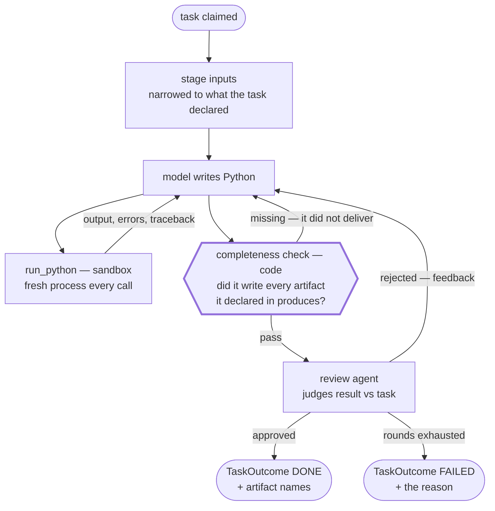

The sandbox surface the model is given is four names — `pd`, `load(name)`,
`emit(name, value)`, and an `out` directory — with **no database, no network, and
no credentials**. A DataFrame emitted becomes a table, a dict becomes a chart
spec, a string becomes text; anything written to `out` is picked up by filename.

Two properties are stated to the model explicitly because they otherwise cause
silent wrong answers: every call is a **fresh process**, so nothing survives
between calls; and it is given the *whole* of each input, so it should look
before it computes.

The one deterministic gate is **completeness**, in code, before the review agent
is called: every name the task declared in `produces` must actually have been
written, or the round fails with `declared [...] but produced [...]`. It is
cheap, it is the failure that strands everything downstream, and it costs no
model call.

> **Known drift:** the review agent's prompt still tells it that "something
> automatic has already confirmed the code ran and that the results are not
> empty or degenerate". That was `validation_service`, which no longer exists —
> only the completeness check survives. The prompt is currently claiming a
> guarantee nothing provides.

Bounded by `MAX_REVIEW_ROUNDS = 2` and `MAX_TURNS = 10`. Past that it isn't
converging, and the queue's retry is the better mechanism.

The analyst reviews **its own** result before reporting success, which is why
there is no separate critic role in a plan. A critic node was tried and removed:
it doubled graph size to re-check something the worker was better placed to
check, having actually seen the data

#### synthesizer — draft, then check

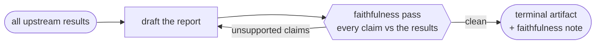

`TERMINAL = True`, so exactly one of these ends a run. The faithfulness check is
a second model reading the report against the results it was given, and its note
is stored alongside the report — the run's answer arrives with its own audit.

#### Where the power is, and what is deliberately missing

The scaffolding is the achievement so far; the **library is not built yet**.

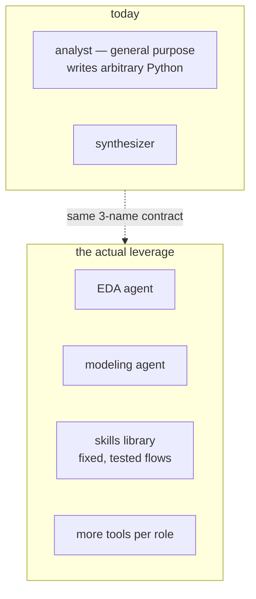

A general-purpose analyst writing arbitrary Python is the *weakest* version of
this. The power is in a **library of skills** — parameterised, tested flows a
planner selects rather than a model improvising — and in specialised roles with
richer tools. The contract is already there to hang them on. This is where the
work goes next.

---

## 5. The orchestrator

Approval is the boundary. Nothing is spent until a human has seen the plan.

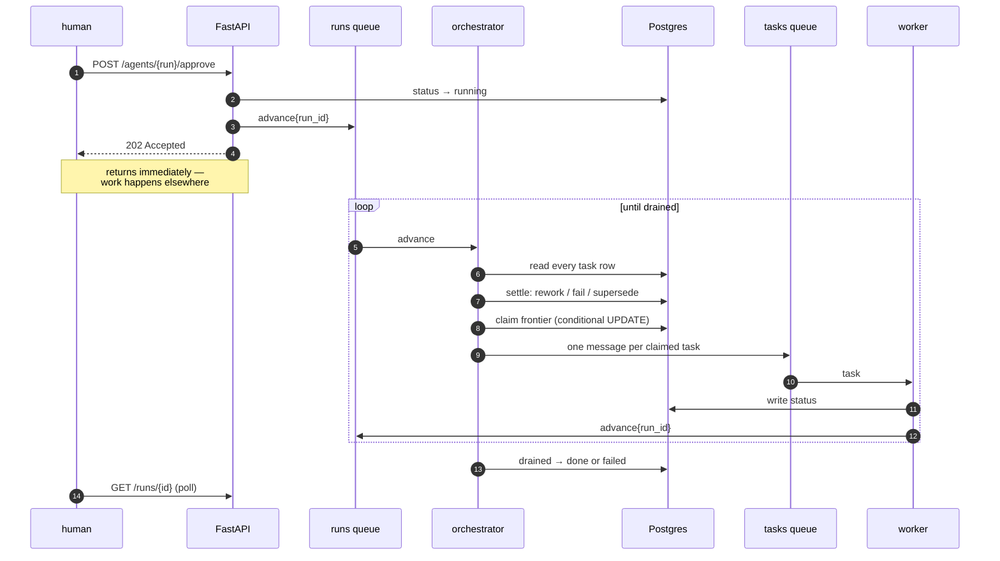

### 5.1 The one idea

**An advance message means "look at this run" — never "task 7 finished".**

It carries nothing but a run id. Whoever handles it rebuilds the entire picture
from the task rows. That single choice buys almost everything else:

| Property | Consequence |
|---|---|
| **Level-triggered** | Duplicates are free — a redelivery costs one wasted query |
| **Stateless handler** | No state rides in the message and none is held by the handler |
| **Resumable** | A process can die between any two steps; the next advance rebuilds |
| **No callbacks** | A worker's completion *is* a message on the runs queue |

`advance` is a **handler, not a loop**: load state, make one decision, publish,
return. It never waits, and it makes **no model call at all** — replanning is
itself a dispatched role. What it does is entirely determined by the task rows,
which makes it deterministic and testable.

### 5.2 One advance, in order


**Order matters.** A task can only be declared dead once it is out of attempts,
and its descendants can only be superseded once it is. Step 3 exists because
without it, dependents of a permanently failed task sit `pending` forever — not
terminal, so the run never finishes, and no further advance is coming to look at
them.

### 5.3 The claim is the lock

```sql
UPDATE run_tasks
   SET status = 'running', attempts = attempts + 1, started_at = ...
 WHERE run_id = ? AND task_id = ? AND status = <the status this advance read>
```

Two advances can be in flight for the same run — a duplicate delivery, or two
orchestrator processes. Both read task 7 as `pending`; both try to dispatch it.
Postgres serialises the two updates, the first flips the row, the second matches
**zero** rows and skips.

**No queue property is relied on to keep them apart.** Correctness comes from a
row-level compare-and-set. FIFO ordering and visibility timeouts reduce how often
the race happens; the `WHERE` clause is what makes it safe. This is the whole of
what makes horizontal scaling of the orchestrator sound.

### 5.4 Two queues, and why neither is FIFO

| | `runs` | `tasks` |
|---|---|---|
| Body | `{run_id}` | `{handler, run_id, task_id}` |
| Meaning | "look at this run" | "execute this task" |
| Type | Standard | Standard |
| Visibility timeout | 30s — an advance is a query and some updates; longer means wedged | 300s — an analyst running generated code is the long pole |
| Long poll | 20s | 20s |
| DLQ after | 5 deliveries | 3 deliveries |

**`tasks` is not FIFO** because the frontier is dispatched precisely *because*
those tasks are independent. A FIFO group per run would serialise exactly the
parallelism the DAG exists to express.

### 5.5 Acknowledgement, and the gap that remains

A handler that returns means the message is done and gets deleted. A handler that
**raises leaves the message untouched**, so it reappears after the visibility
timeout and eventually lands in the DLQ. Deleting in a `finally` would quietly
discard the retry the queue is configured for.

The task consumer always requests an advance, whatever the outcome — success,
failure, or an unknown role — because the alternative is a run nobody will ever
look at again.

**The known gap: there is no sweeper.** Writing a task's status and publishing
its advance are two steps. A process dying between them strands the run: it stays
`running`, no task is `running`, both queues are empty, and nothing will ever
look at it again. This has been observed, not theorised. A sweeper that only
looks for stale `running` tasks would not catch it — it must also re-advance any
`running` run with no active tasks and nothing queued.

---

## 6. Code layout

Two deployables from one repo; three processes from one image.

```
agentics/
├── backend/
│   ├── server/            FastAPI — the only process that talks to a human
│   │   └── routers/       sessions · artifacts · runs · agents · health
│   ├── workers/           the processes that talk to queues
│   │   ├── consumer.py      the loop — ONE copy, shared by both
│   │   ├── orchestrator.py  python -m workers.orchestrator  → runs queue
│   │   └── task.py          python -m workers.task          → tasks queue
│   ├── services/          the logic. no framework, no HTTP
│   │   ├── agents/          planner · tools · roles/{analyst,synthesizer}
│   │   ├── dag_service.py       PURE — topology
│   │   ├── profile_service.py   PURE — dataframe → profile
│   │   ├── run_service.py       IO — runs and task rows
│   │   ├── artifact_service.py  IO — the one public write
│   │   ├── session_service.py   IO — the ONLY ownership check
│   │   └── orchestrator_service.py
│   ├── external/          everything that talks to something outside
│   │   ├── postgres · queue · storage/{local,s3} · sandbox · cognito · llm
│   ├── models/            wire shapes, db/ for tables
│   └── tests/             unit (no containers) + integration/ (skips w/o pg)
└── client/                Next.js — upload · ask · approve · watch · read
```


### Servers vs consumers

| | server | consumer |
|---|---|---|
| Entry | `uvicorn` | `python -m workers.{orchestrator,task}` |
| Triggered by | HTTP | queue message |
| Talks to | humans | queues |
| Scales on | request rate | queue depth |

`consumer.py` holds the loop exactly once. A consumer *is* a queue name and a
handler; long polling, startup, acknowledge-on-success-only, and SIGTERM handling
are identical for all of them and live in one place. Each consumer module is a
handler plus a one-line entrypoint.

### `external/` and the boot rule

Every module in `external/` exposing a module-level `ExternalService` is
discovered by `pkgutil` and started by **every process**, because a service that
fails anywhere is a problem everywhere. There is no per-process subset and no
registry — dropping a module in the directory is the whole of adding one.

### Ownership lives in exactly one service

`session_service.get(session_id, user_id)` is the only place a user is checked
against anything. `run_service` and `artifact_service` take a `session_id` and
filter rows; they must not import `session_service` or reason about users. Routes
resolve the session once and pass the id down.

---

## 7. What's next

Ordered roughly by how much each one is currently hurting.

### Reliability

- **A sweeper.** The gap in §5.5. This is what separates deployable from demo.
- **More nuanced exceptions.** Right now too much collapses into a generic
  service-layer error, which means the orchestrator's retry decision is coarser
  than it should be. A model refusing a task, a sandbox timing out, a transient
  database error, and a genuinely impossible task should not all be one shape —
  only some of them are worth retrying, and the retry ladder can't currently
  tell them apart.
- **Re-planning mid-execution.** The design is settled and unbuilt: never replan
  into a moving graph and never cancel. Set a run-level `replan_pending` flag,
  dispatch nothing while `ACTIVE` tasks remain, and let the last worker's advance
  trigger the replanner as a dispatched role. The flag-set must *fall through* to
  the drain check, or a lone failure hangs the run. Retry exhaustion, not a
  single failure, is what triggers it.

### Agents

- **A skills library.** Fixed, parameterised, tested flows the planner selects
  instead of a model improvising pandas. This is the single biggest lever.
- **Specialised roles** — an EDA agent and a modeling agent, rather than one
  general analyst.
- **Better parallelisation.** The planner now has a decomposition criterion, but
  the axis it decomposes along is still emergent rather than expressed. Fan-out
  across segments, files, or features should be a first-class shape.
- **Harden artifact naming.** Qualified names removed the collision class, but
  the planner is the only thing guaranteeing a consumed name matches a produced
  one. It has been reliable in testing and is not strong enough for harder
  problems.

### Data and output

- **A formal data quality report.** The profile is currently types, nulls,
  cardinality, and ranges. It should be a real DQR — and, more importantly, one
  with **interpretation** attached, so downstream agents inherit judgement about
  the data rather than raw statistics.
- **Real output handling.** Charts are stored as specifications and nothing
  renders them; frames are parquet but the answer that reaches the user is plain
  text. Charts, tables, and downloadable parquet should all be first-class in the
  report.

### Security

- **Local JWT verification.** Replace the per-request `GetUser` introspection
  call with JWKS-cached RS256 verification in-process, keeping introspection or a
  deny list for revocation. §3.6 has the trade-off in full.
- **Sign internal messages.** Asymmetric signature plus nonce and expiry on
  anything crossing a process boundary, so a worker can verify the publisher and
  reject replays instead of trusting the network.
- **Capability-scoped artifact handles**, so access fails closed on a bad token
  rather than relying on every query remembering to scope itself.

### Infrastructure

- **Dispatch the sandbox to dedicated workers.** Executing generated code
  currently happens inside the task worker. It should be its own pool, sized and
  resourced for the job — heavier CPU, GPU where modeling needs it — so that
  compute-hungry execution scales independently of orchestration and cannot
  starve it.
- **Metering.** .
- **Actually deploy it.** No AWS account is provisioned yet.

---

## 8. The tradeoff being made

This architecture is **more machinery than a single-CSV question needs**. That is
the deliberate cost. Every piece of it — the claim, the level-triggered advance,
the DLQ, the opaque handle, the pure/IO split — exists because of what happens
when work is parallel, long-running, and has to survive a process dying.

The honest summary: for one person analysing one file, a chat tool wins. For an
organisation running the same question across a thousand of them, with an audit
trail and a human gate on spend, this is the shape the problem actually has.
