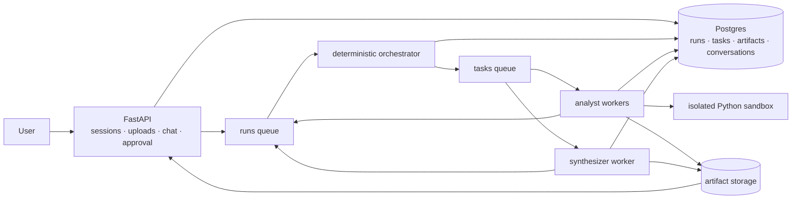
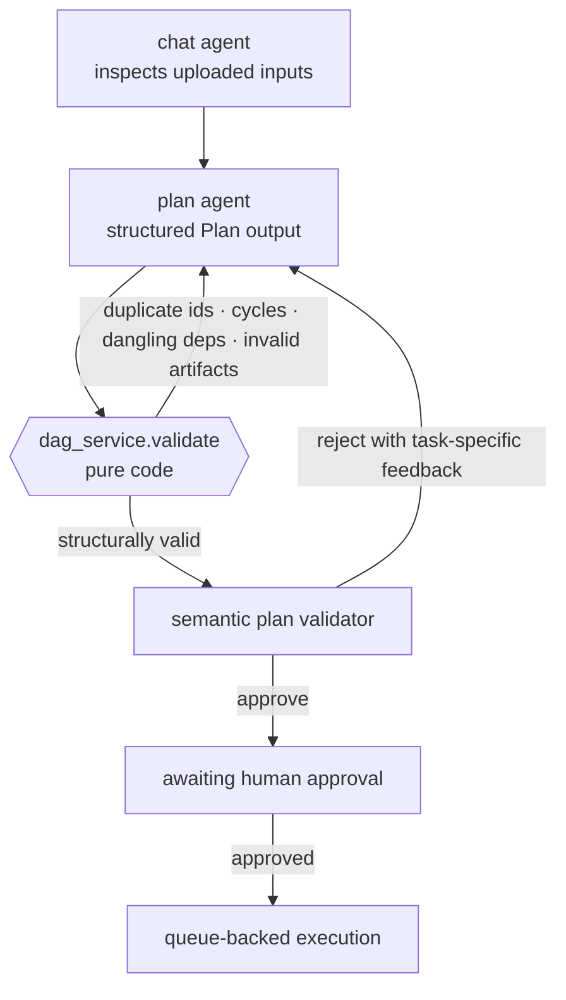
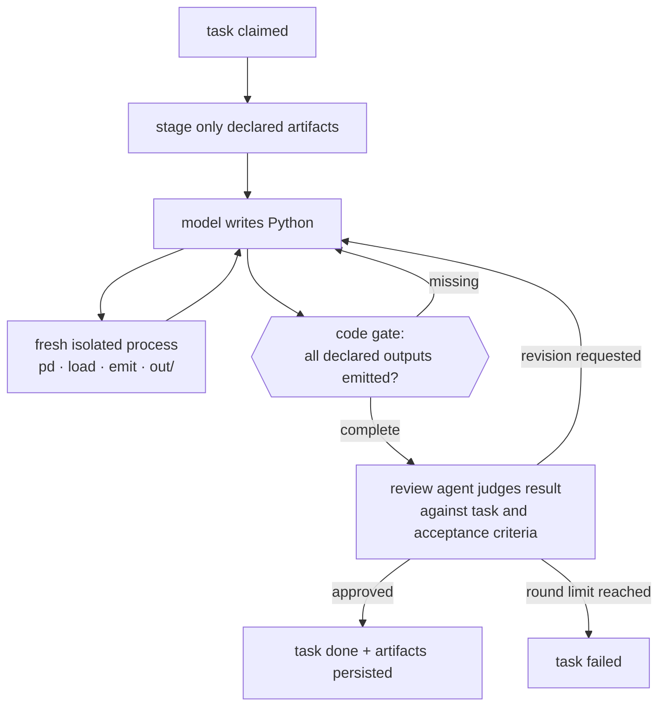
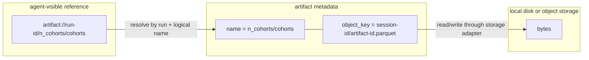
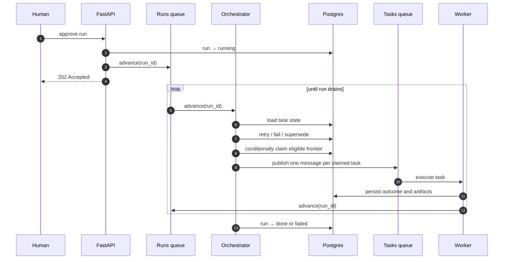
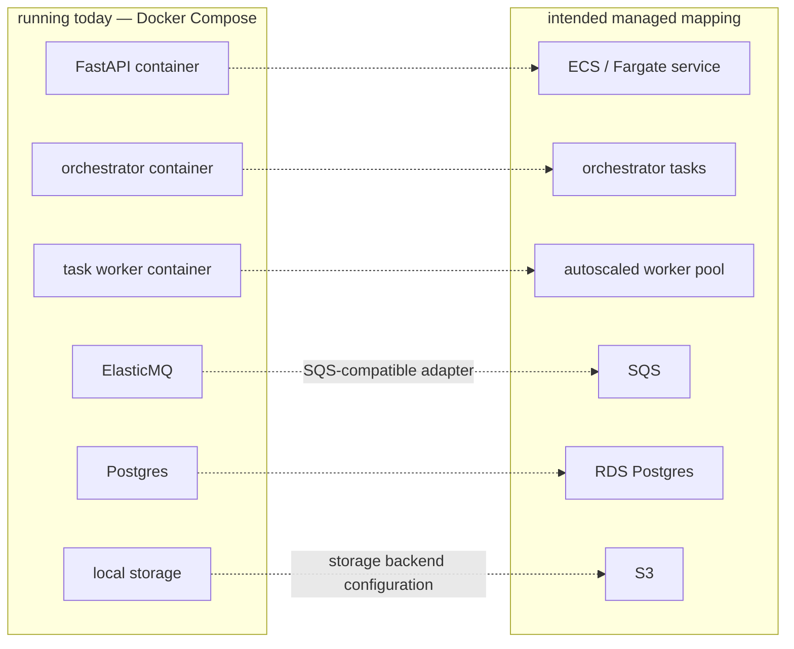

# Agentics — Technical Overview
Author: Ebrahim alhaddad

Date: 07/31/2026

> A multi-agent orchestration system demonstrated through exploratory data analysis.
> The analysis is the **load**. The orchestration is the **product**.

Agentics turns a natural-language data question into a validated task graph, pauses for human approval, executes independent tasks through queue-backed workers, persists every intermediate result as a scoped artifact, and synthesises the final answer from the completed graph.

The project is intentionally not another “chat with a CSV” interface. It focuses on the engineering underneath an agent workflow: decomposition, isolation, scheduling, verification, retries, persisted state, and recovery when work outlives the request that created it.

**Current posture:** built and tested locally with Docker Compose. The services and adapters are separated so they map naturally to managed queues, Postgres, object storage, and independently scaled container workloads. A production cloud deployment has not yet been completed.

**Stack:** Python · FastAPI · Postgres · SQS/ElasticMQ · local/S3 storage · Cognito · Docker Compose · Next.js

[Read the full design document](https://github.com/ebrahimAlhaddad/agentics-multi-agent-system/blob/main/DESIGN.md)

---

## Why this project exists

Agent demos are easy because the happy path is short: give a model a tool and show a successful result. An operational system has to solve a different set of problems:

1. **Decomposition** — turn one request into units of work that can run independently and be checked independently.
2. **Scoping** — expose only the data each task declared, instead of relying on prompt instructions for access control.
3. **Distribution** — run eligible tasks concurrently across separate worker processes.
4. **Verification** — distinguish valid structure, executable code, complete outputs, and semantically correct results.
5. **Recovery** — persist enough state to retry, supersede, or resume work after process and delivery failures.
6. **Control** — let a human inspect the proposed plan before execution work is dispatched.

These are primarily distributed-systems concerns with models embedded inside them. The design therefore keeps model judgement where judgement is useful and moves scheduling, state transitions, dependency resolution, and structural validation into deterministic code.

> **The model proposes the plan; specialised agents execute it over deterministic scheduling machinery.**

Analytics is a useful test load because its failures are not flattering. Python can execute successfully while answering the wrong question, intermediate computations naturally fan out across segments or cohorts, and realistic work can outlive one HTTP request. That forces the system to address both mechanical correctness and semantic review.

---

## System at a glance



A run moves through four distinct phases:

1. **Inspect and plan.** A chat agent inspects available data and asks a planner to produce a typed DAG.
2. **Validate and approve.** Pure code checks graph structure; a semantic validator checks whether the graph can answer the question. The user approves the accepted plan.
3. **Execute.** The orchestrator claims the eligible frontier and publishes one message per task. Analyst workers write and run Python against scoped inputs.
4. **Synthesize.** A terminal role reads upstream artifacts, writes the report, and performs a separate faithfulness pass against the evidence.

The API, orchestrator, and task workers are separate processes. Postgres is the source of truth for workflow state; queue messages are signals to inspect or execute that persisted state.

---

## Agents: judgement at the edges, code in the middle

The orchestrator is deliberately **not** an agent. Models decide what work should exist and judge whether results answer the task. Code decides which task is eligible, whether a graph contains a cycle, whether an output was actually produced, and when a run is drained.

### Planning pipeline



The plan is generated through constrained structured output, but schema compliance is only the first layer. `dag_service.validate` then checks properties that should never depend on a model:

| Deterministic check | Failure prevented |
|---|---|
| Unique task IDs | Ambiguous dependencies and artifact collisions |
| Valid dependency references | Tasks waiting on nodes that do not exist |
| Acyclic graph | Deadlocked execution |
| Known worker roles | Tasks with no executable handler |
| Reachable consumed artifacts | Tasks requesting outputs no ancestor can produce |
| Exactly one terminal role | Runs with no final answer or competing final answers |

Only structurally valid plans reach the semantic validator. That second model checks what topology alone cannot: whether the proposed work addresses the actual question, uses available columns, decomposes independent calculations, and gives each task a checkable acceptance condition.

A plan is persisted directly as `run_tasks` rows. There is no second JSON representation to keep synchronised; the task rows **are** the executable plan.

### Example plan

```jsonc
{
  "question": "Which region has the highest average revenue per unit?",
  "approach": "Compute revenue per unit by region, then identify the maximum.",
  "nodes": [
    {
      "id": "calculate_average_revenue",
      "role": "analyst",
      "description": "Calculate average revenue per unit for each region.",
      "acceptance": "One row per region with the calculated metric.",
      "depends_on": [],
      "consumes": ["input/sales"],
      "produces": ["average_revenue_per_region"]
    },
    {
      "id": "write_final_report",
      "role": "synthesizer",
      "description": "Identify the leading region and explain the result.",
      "acceptance": "Names the region and cites the supporting value.",
      "depends_on": ["calculate_average_revenue"],
      "consumes": ["average_revenue_per_region"],
      "produces": ["summary"]
    }
  ]
}
```

`produces` and `consumes` make the graph operational rather than decorative. They tell the validator whether data can reach a task, tell the staging layer exactly which inputs to expose, and give downstream nodes stable logical names for intermediate outputs.

### Analyst: write, execute, verify



The sandbox exposes a deliberately small surface: `pd`, `load(name)`, `emit(name, value)`, and an output directory. It runs without database access, cloud credentials, or network access. Every execution starts in a fresh process.

Before a review model is called, code verifies that the analyst emitted every artifact named in `produces`. This cheap check prevents a task from reporting success while leaving its dependants permanently unable to run.

The review step then evaluates the result against the task description and acceptance criteria. Execution success alone is insufficient: a valid `groupby` on the wrong field is still a wrong answer.

### Synthesizer: report with a faithfulness pass

The terminal worker receives completed upstream artifacts rather than the original unrestricted dataset. It drafts the final report, then a separate model compares each claim with the supplied results. The final artifact is stored with the faithfulness note so the answer retains an audit link to its evidence.

Worker roles are modules discovered from `services/agents/roles/`. Each role exposes a description, whether it is terminal, and an async handler. The planner’s available-role description is generated from those modules, so adding a role does not require maintaining a separate prompt registry.

---

## Artifact handling: logical references, isolated storage

Artifacts are the contract between tasks. Uploads, intermediate DataFrames, chart specifications, generated files, and final reports all use the same persistence model.



An agent sees a **handle**, not a filesystem path or object-store key.

| | Logical handle | Storage key |
|---|---|---|
| Shape | `artifact://<run_id>/<name>` | `<session_id>/<artifact_id>.<ext>` |
| Used by | Plans, agents, task rows | Artifact service and storage adapter |
| Purpose | Logical reference inside the workflow | Physical byte location and prefix cleanup |
| Access | Resolved through declared task inputs | Never constructed by a model |

Artifact names are qualified by their producer: `n_cohorts/cohorts`, `profile_sales/summary`, or `input/sales`. This gives the graph an explicit dataflow and avoids giving agents direct access to storage layout.

The staging layer resolves only the artifacts listed in a task’s `consumes` field. A prompt cannot ask the sandbox to walk a bucket or inspect an arbitrary path because neither the path nor storage credentials exist in its environment.

Artifact metadata lives in Postgres; bytes live behind a storage interface with local and S3-backed implementations. Deleting a session can therefore cascade relational metadata and delete one storage prefix.

---

## Orchestration: a level-triggered state machine

The central orchestration idea is deliberately small:

> **An advance message means “inspect this run,” not “task 7 completed.”**

An advance contains the run ID. The orchestrator reloads every task row, settles retry and supersession transitions, computes the eligible frontier, conditionally claims tasks, and publishes their work messages. No workflow state is carried inside the advance message.



Because the message is level-triggered, duplicate advances are cheap: they cause another state read rather than applying a duplicated event. The handler is stateless between messages and makes no model calls.

### The claim is the lock

Multiple orchestrator consumers may inspect the same run. A conditional update decides which one owns a dispatch:

```sql
UPDATE run_tasks
   SET status = 'running',
       attempts = attempts + 1,
       started_at = ...
 WHERE run_id = ?
   AND task_id = ?
   AND status = <status previously read>;
```

Two consumers can both read a task as `pending`, but only the first update changes the row. The second matches zero rows and does not publish the task. Correctness at this boundary comes from Postgres compare-and-set semantics rather than queue ordering.

The orchestrator processes transitions in a fixed order:

1. Failed tasks with attempts remaining become `rework`.
2. Dispatchable tasks with no attempts remaining become permanently `failed`.
3. Descendants of permanently failed work become `superseded`.
4. A drained run becomes `done` or `failed`.
5. Otherwise, the next eligible frontier is conditionally claimed and dispatched.

The `superseded` state matters: without it, descendants of an unrecoverable task remain pending forever and the run can never drain.

---

## Queue design

The system uses two standard queues with different responsibilities:

| | Runs queue | Tasks queue |
|---|---|---|
| Message | `{handler, run_id}` | `{handler, run_id, task_id}` |
| Meaning | Re-evaluate persisted run state | Execute one claimed task |
| Consumer | Orchestrator | Role-specific task worker |
| Visibility | Short; advancing is DB/state work | Longer; analysis is the slow path |
| Failure path | Redelivery, then DLQ | Redelivery, then DLQ |

The tasks queue is not FIFO because the DAG already defines ordering. Tasks in the same frontier are independent by construction and should be available to separate workers concurrently.

A consumer deletes a message only after its handler returns successfully. Exceptions leave the delivery unacknowledged so it can reappear after the visibility timeout. `receipt_handle` belongs to one delivery, not to the logical message; a redelivery has a new receipt handle. A receive count above one indicates that an earlier delivery was not deleted, which may reflect a crash, timeout, or processing that exceeded visibility.

The current 300-second task visibility setting assumes handlers finish within that window. Longer jobs require periodic visibility extension or a separate lease/heartbeat mechanism to prevent concurrent redelivery.

---

## State and access boundaries

A session owns runs and artifacts. A run owns its task graph and generated outputs. Authentication is resolved at the HTTP boundary through Cognito, while ownership is enforced in one service:

```text
validated token
    ↓
session_service.get(session_id, user_id)
    ↓
resolved session_id
    ↓
run_service / artifact_service
```

`user_id` is not accepted from request bodies or query parameters. A session that does not exist and a session owned by someone else both return 404, avoiding an ownership oracle. Below the session boundary, services operate on a resolved `session_id` rather than reimplementing user checks throughout the codebase.

The internal queue boundary is not yet zero-trust. Queue messages are trusted because they arrive through internal infrastructure, and artifact handles are opaque but not cryptographically signed. Message signatures, nonces, expiries, and per-role credentials remain future hardening work.

---

## Scalability model

The architecture separates three workloads that scale for different reasons:

| Process | Trigger | Scaling signal | Main responsibility |
|---|---|---|---|
| API | HTTP requests | Request rate and latency | User interaction, uploads, approval, reads |
| Orchestrator | Runs queue | Advance backlog | State transitions and task dispatch |
| Task workers | Tasks queue | Queue depth and task duration | Model calls, sandbox execution, artifact production |

This separation matters because coordination and computation have different resource profiles. The orchestrator performs short database-oriented work; analyst workers perform the expensive model and Python execution path. More task workers can be added without increasing API replicas, and the orchestrator can be scaled independently when many runs are changing state.

The current sandbox runs inside the task-worker path. A larger deployment would move execution into a dedicated compute pool so CPU-heavy analysis or model training cannot starve orchestration. That pool could scale independently and expose different CPU, memory, or GPU profiles by role.

Postgres remains the coordination source of truth and therefore an intentional central dependency. The design scales worker execution horizontally, but it does not claim unbounded throughput or remove database contention; those properties require measurement and load testing.

---

## Deployment mapping



Local development uses ElasticMQ through the SQS API and enables strict queue limits to catch some incompatible behaviour early. Storage is selected behind a local/S3 interface. The API, orchestrator, and task consumer use the same application image with separate entry points, keeping deployment units consistent while preserving process isolation.

This is an architectural mapping, not a claim that production deployment is complete. Infrastructure provisioning, operational dashboards, secrets management, autoscaling policies, and production load validation remain to be built.

---

## Reliability: what works and what remains

The current implementation demonstrates persisted workflow state, conditional task claims, bounded task attempts, queue redelivery, terminal and superseded states, and deterministic run advancement.

Two database-to-queue gaps remain important:

1. **Claim then publish.** The orchestrator can mark a task `running` and exit before publishing its task message.
2. **Outcome then advance.** A worker can persist a task result and exit before publishing the next run advance.

Either gap can strand a recoverable run even though the authoritative state remains in Postgres. The production path is a transactional outbox or equivalent reconciliation mechanism, plus a sweeper that re-advances stale runs and repairs active tasks with no valid lease.

Long-running work also needs:

- visibility extension or worker heartbeats;
- attempt or lease tokens so stale deliveries cannot commit over newer attempts;
- idempotent artifact publication tied to an attempt;
- reconciliation between DLQ entries and persisted workflow state;
- a more precise exception taxonomy for retryable and terminal failures.

These limitations are documented because they are part of the engineering subject of the project, not hidden behind a successful demo.

---

## Repository structure

```text
agentics/
├── backend/
│   ├── server/                 FastAPI routes and SSE
│   ├── workers/
│   │   ├── consumer.py         shared queue-consumer loop
│   │   ├── orchestrator.py     runs queue entry point
│   │   └── task.py             tasks queue entry point
│   ├── services/
│   │   ├── agents/             planner, tools, analyst, synthesizer
│   │   ├── dag_service.py      pure graph validation
│   │   ├── orchestrator_service.py
│   │   ├── artifact_service.py
│   │   ├── run_service.py
│   │   └── session_service.py
│   ├── external/               Postgres, queues, storage, sandbox, Cognito, LLM
│   ├── models/                 database and wire models
│   └── tests/                  unit and integration tests
└── client/                     Next.js demonstration interface
```

The service layer contains the application logic without HTTP concerns. `external/` contains adapters for infrastructure. Pure functions, especially DAG and profile validation, are separated from I/O-heavy services so they can be exercised with hand-built inputs and unit tests.

---

## Use of AI

AI was used extensively to accelerate frontend work, tests, and documentation. It also assisted with Routine implementation, refactoring, and debugging. The architecture, state machines, service boundaries, queue semantics, artifact model, and failure-handling decisions were directed and reviewed by the author.

Generated code was read, executed, modified, and removed when it did not fit the system. Backend design and implementation is driven by Author

---

## What this project demonstrates

 The repository demonstrates work across several layers:

- **Distributed workflow design:** persisted DAGs, queue consumers, redelivery, retries, conditional claims, and terminal-state handling.
- **Agent-system boundaries:** model judgement for planning and review; deterministic code for topology, scheduling, completeness, and state transitions.
- **Data isolation:** logical artifact handles, scoped staging, storage abstraction, and sandboxed execution.
- **Failure analysis:** explicit treatment of duplicate delivery, stale work, database-to-queue gaps, visibility windows, and recovery mechanisms.
- **Deployable process boundaries:** separate API, orchestration, and compute roles with queue-depth-based scaling paths.
- **Engineering ownership with AI-assisted implementation:** generated code used as leverage rather than treated as authority.

The system is intentionally more machinery than one analyst asking one question about one CSV requires. That is the tradeoff. For a single interactive analysis, a notebook or hosted chat tool is simpler. For repeated, parallel, auditable work that must survive process boundaries, this is the class of machinery the problem begins to require.
